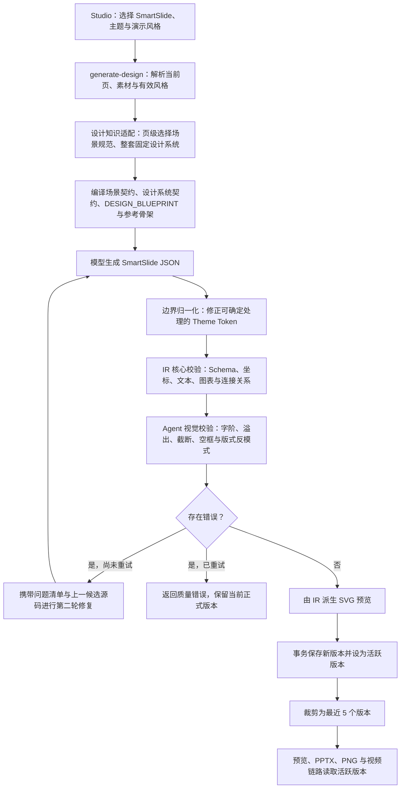

# SmartSlide 设计与生成过程

> 状态：已实现，继续灰度验证  
> 最近更新：2026-07-29  
> 适用范围：PPT Studio 的 SmartSlide 生成、预览、修复、版本切换与导出链路  
> 架构真相源：[`smartdiagram_architecture.md`](../smartdiagram_architecture.md)。若本文中的路径或边界与架构文档、代码不一致，以后两者为准。

---

## 1. 为什么设计 SmartSlide

早期 PPT 设计稿以模型直接生成 SVG 为主。SVG 自由度高，适合快速探索视觉方案，但也暴露出几个稳定性问题：

- 模型容易生成附着式整高色条、等分卡片和大段文字等明显的 AI 模板感。
- SVG 图元的层级、连接线、文字框和装饰元素容易互相遮挡。
- 文字宽高、连接线穿越正文、禁止的 SVG 特性等问题，要到生成后才能发现。
- SVG 更接近最终画面，不适合作为可编辑 PowerPoint 对象的长期中间格式。
- 只靠一段“大而全”的提示词，设计知识难以复用，也难以定位失败属于内容、布局还是渲染。

SmartSlide 因此采用独立的结构化页面语言作为设计稿真相源。它描述页面尺寸、主题、背景和有序图元，再派生 SVG 预览，并可直接映射为 PowerPoint 原生对象。

两种模式的定位如下：

| 模式 | 真相源 | 优点 | 当前定位 |
|------|--------|------|----------|
| SVG | SVG 源码 | 表现自由、适合视觉探索 | 默认模式 |
| SmartSlide | 结构化 IR | 可校验、可修复、可编辑、可稳定导出 | 灰度模式 |

SmartSlide 的 SVG 只是预览副本，不是它的源数据。

---

## 2. 需求演进与关键决策

| 阶段 | 发现的问题 | 形成的设计 |
|------|------------|------------|
| SVG 直接生成 | 图元重叠、连接线穿字、整高色条、文字溢出 | 建立 SVG 空间与视觉反模式门禁 |
| 增加风格选择 | 切换风格后页面变化不明显 | 将“风格”定义为构图、字阶、密度和用途；将“主题”只用于色彩与质感 |
| 引入 SmartSlide | 需要结构化、可编辑的 PPT 中间语言 | 新建隔离的 `packages/slide-ir/`，不替换原 SVG 链路 |
| 接入 Kimi 设计知识 | 直接注入整份 Skill 太长；只传资料标题又等于没有真正使用知识 | 页级选择场景规范、整套固定一个设计系统，并把两者正文中的关键章节编译进提示词 |
| 首轮质量门禁 | 模型输出不合格时只返回错误，不能有效自修复 | 第二轮同时携带精确问题与上一候选源码 |
| Theme Token 报错 | 模型把 `$body` 等引用写进 `theme.tokens` | 在严格 Schema 前做确定性边界归一化 |
| 中英混排误报 | 两套文字高度估算规则漂移，正常标题被判溢出 | IR 核心与 Agent 质量门禁共用一套文字测量函数 |
| 多次重新生成 | 新稿覆盖旧稿，失败后无法回退 | 每页保留最近 5 个版本，预览与导出始终使用活跃版本 |

核心原则是：**模型负责提出设计候选，确定性代码负责约束、校验、修复边界和版本安全。**

---

## 3. 当前总体链路



生成成功的提交点位于两层质量门禁之后。任何未通过校验的候选稿都不能覆盖当前正式版本。

---

## 4. 四个相互独立的控制面

SmartSlide 不再把所有视觉要求混在一个“主题”概念里，而是拆成四个控制面：

| 控制面 | 回答的问题 | 主要内容 |
|--------|------------|----------|
| 内容 | 这一页讲什么 | 页面标题、核心结论、内容块、事实材料 |
| 风格 | 信息怎样组织 | 构图原型、用途场景、字阶、信息密度、禁止模式 |
| 主题 | 页面是什么质感与颜色 | 背景、正文色、主色、辅助色、字体族 |
| 生成模式 | 用什么语言表达设计稿 | SVG 或 SmartSlide IR |

因此：

- 切换主题，主要改变颜色与质感，不应大幅改变信息结构。
- 切换风格，必须影响布局、信息层级、留白和视觉焦点。
- 切换为 SmartSlide，改变的是设计稿的源格式和后续校验、导出路径。
- 当前页只有在按新风格重新生成成功后，才会应用新的风格；仅选择风格不会无损重排已有稿件。

---

## 5. 设计知识如何进入提示词

### 5.1 知识来源

`packages/agents/src/designKnowledge/` 统一维护：

- 页面视觉配方与构图语义；
- Apple 编辑式视觉约束；
- 空间碰撞、DOM 层级与视觉反模式规则；
- Kimi Slides 设计知识适配器。

`kimiSlides/` 不把完整 Skill Markdown 直接交给模型，而是把外部资料作为只读设计知识库使用。

### 5.2 确定性选择

适配器使用两个不同的选择层级：

1. **页级场景规范**：根据当前页的读者任务、内容关系与推荐布局选择，例如封面、对比、路线图、指标页或架构页；
2. **整套设计系统**：根据用户选择的演示风格、主题和设计系统路径亲和度选择，例如极简、咨询、数据叙事或科技架构；同一套演示文稿不能因为单页内容变化而漂移到另一套设计系统。

场景规范决定“这一页应解决什么阅读任务”，设计系统决定“整套演示文稿长什么样”。两者分开选择，既允许不同页面采用不同关系构图，又能保持全套的色彩、字体、组件和节奏一致。

### 5.3 编译真实知识契约

选中资料后不能只把文件名或标题告诉模型。适配器会从实际 Markdown 内容中提取与当前生成直接相关的章节，并分别编译为：

- `SCENARIO_CONTRACT`：核心特征、通用禁用项、页面节奏、特定关系图规则和交付前检查；
- `DESIGN_SYSTEM_CONTRACT`：风格定位、页面骨架、内容组织、页面类型、字体、标志性组件、图形语言、禁用项和生成检查。

随后再结合当前页内容编译页面级 `DESIGN_BLUEPRINT`，主要包含：

- 构图原型；
- 内容区坐标与占比；
- 标题、正文和注释字阶；
- 每个区域的内容预算；
- 必需图元与关系；
- 禁止出现的视觉模式。

模型同时获得一份由程序生成的 SmartSlide 参考骨架。参考骨架用于示范合法结构、颜色写法和图元层级，不替代当前页面内容，而且它自身必须通过与模型候选相同的视觉质量门禁。

当规则发生冲突时，优先级是：

1. 当前页真实的内容关系与读者任务决定构图；
2. 设计系统决定字体、组件、节奏和质感；
3. 参考骨架只提供结构语法与比例示例，不允许模型机械照抄。

### 5.4 为什么不直接注入整份 Skill

整份 Skill 同时包含格式、CLI、设计系统、页面分类和大量示例。全部注入会造成：

- 页面任务与通用说明争夺上下文；
- 模型倾向复制示例表面形式，而不是遵守当前页布局；
- 出错时无法判断是哪条设计知识真正生效；
- 提示词长度和生成延迟显著增加。

当前策略是“**选择一份场景规范和一套设计系统，提取真实规则，编译成约束，再生成候选**”，而不是“把资料全部塞给模型”，也不是“只把资料标题发给模型”。

---

## 6. SmartSlide 页面语言

SmartSlide 使用 `smartslide/1` Schema，画布固定为 `1280 × 720`。文档包含：

- 主题 Token 与字体；
- 页面背景；
- 按数组顺序排列的图元；
- 可选的生成元数据。

支持的主要图元包括：

- `text`
- `shape`
- `line`
- `image`
- `table`
- `chart`

数组顺序就是 Z 轴顺序：先出现的图元在下层，后出现的图元在上层。连接线必须先于其文字节点绘制，避免压住正文。

结构示意如下，具体字段与约束以 `packages/slide-ir/src/schema.ts` 为准：

```yaml
schema: smartslide/1
pageType: content
canvas:
  width: 1280
  height: 720
theme:
  tokens:
    bg: "#F5F5F7"
    body: "#1D1D1F"
background:
  color: "$bg"
elements:
  - id: page-title
    type: text
    bounds: [72, 56, 760, 64]
    paragraphs:
      - runs:
          - text: "页面标题"
            fontSize: 34
            fontWeight: 700
            color: "$body"
```

颜色存在两套写法，不能混用：

| 位置 | 合法写法 | 说明 |
|------|----------|------|
| `theme.tokens.*` | `#RRGGBB` | Token 的具体定义 |
| 图元颜色字段 | `#RRGGBB` 或 `$tokenName` | 具体颜色或 Token 引用 |

例如 `theme.tokens.body: "$body"` 是非法循环引用；`element.color: "$body"` 才是合法引用。

---

## 7. 提示词组装

`buildSlideIrPrompt` 将以下内容按稳定顺序组合：

1. 页面标题、核心信息与页面目标；
2. 推荐布局；
3. 当前演示风格的 ID、名称、构图、字阶、密度和禁止模式；
4. 当前主题；
5. 页级 `SCENARIO_CONTRACT` 与整套稳定的 `DESIGN_SYSTEM_CONTRACT`；
6. 当前页 `DESIGN_BLUEPRINT`；
7. 内容块与事实材料；
8. SmartSlide 参考骨架；
9. 第二轮才出现的修复说明与上一候选源码。

系统提示词只保留不可协商的语言契约，例如：

- 画布固定为 `1280 × 720`；
- 图元顺序即 Z 轴顺序；
- Token 定义必须是六位 HEX；
- 不得输出 CSS、HTML、SVG 或 Markdown 包裹；
- 页面最多使用有限数量的主要信息组；
- 图元 ID 必须唯一；
- 禁止附着式整高强调色条；
- 标题和正文必须满足最低字号与内容预算。
- 输出前必须先估算每个文字框所需高度，不能把溢出问题留给渲染器。

页面美感主要由“场景契约 + 稳定设计系统 + 蓝图 + 参考骨架”共同控制，而不是靠增加形容词。

---

## 8. 归一化、校验与自动修复

### 8.1 执行顺序

| 顺序 | 阶段 | 处理内容 | 是否可自动修改 |
|------|------|----------|----------------|
| 1 | JSON 边界解析 | 提取模型输出并转换为普通对象 | 否 |
| 2 | Theme Token 归一化 | 用当前主题补全或修正已知 Token 的非法值 | 是，确定性处理 |
| 3 | 严格 Schema | 类型、必填字段、枚举、颜色格式 | 否 |
| 4 | IR 核心校验 | 重复 ID、越界、文字溢出、表格/图表数据、未知 Token、连接线风险 | 否 |
| 5 | Agent 视觉门禁 | 最低字号、可见截断、超大空文本框、等分文字栏、关系图元缺失、系统边界与主次关系退化 | 否 |
| 6 | 模型修复 | 携带精确问题和上一候选源码重新生成 | 模型修复，最多一轮 |

归一化只处理可以无歧义修复的边界格式问题，不能替模型重新设计布局。

### 8.2 两轮生成

首次生成失败后，第二次请求不只传“请修复文字溢出”，而是同时携带：

- 精确到图元 ID 的问题清单；
- 上一候选 SmartSlide 源码；
- 原页面内容、主题、风格和设计蓝图。

这样模型可以局部缩短文案、扩大文字区或调整布局，不必从空白重新猜测整页设计。

两轮仍未通过时抛出 `SlideIrQualityValidationError`。错误候选可用于诊断，但不会写成活跃设计版本。

### 8.3 文字测量

文字溢出曾经存在误报：IR 核心与 Agent 各自维护一套估算逻辑，对中英文混排、数字和标点的宽度判断不一致。

当前统一使用 `packages/slide-ir` 导出的 `estimateTextElementHeight`：

- 中文按全角字符估算；
- 英文、数字和标点按近似半角宽度估算；
- 同时考虑字号、行高、文字框宽度和显式换行；
- 核心校验与视觉门禁共用同一结果。

规则只能做稳定的保守估算，最终仍需要真实字体渲染回归来覆盖极端字体与字重差异。

错误信息会同时返回图元 ID、预计文字高度与可用高度，例如：

```text
node-3-body（预计 112px，可用 84px）
```

第二轮据此决定压缩文案、扩大文字区域或调整构图，而不是盲目缩小字号。

---

## 9. 生成成功后的保存与版本历史

通过全部校验后，服务端执行：

1. 将 SmartSlide IR 渲染为 SVG 预览；
2. 保存 IR JSON；
3. 通过统一事务入口创建 `SlideDesignVersion`；
4. 把新版本设置为当前页的活跃版本；
5. 更新 `Slide.irJson` 与 `Slide.svgPreview`；
6. 只保留该页最近 5 个版本。

历史版本切换不是只换预览图。激活版本时会一并恢复：

- SmartSlide 源码；
- SVG 预览；
- 该版本对应的渲染策略和元数据。

预览、导出当前页、导出 PPTX、PNG、视频和媒体渲染均读取活跃版本。用户切换到哪个版本，导出的就是哪个版本。

---

## 10. 失败保护

SmartSlide 遵守“候选稿与正式稿分离”：

- 新候选没有通过质量门禁时，当前正式版本保持不变；
- 失败信息应包含问题数量、问题位置和失败源码入口；
- 用户仍可切换已有历史版本；
- 只有生成成功后，待更新的风格才会应用到本页；
- 失败候选不得进入正常导出链路。

这解决了早期重新生成直接覆盖旧稿、失败后无法回退的问题。

---

## 11. 代码定位

| 职责 | 主要位置 |
|------|----------|
| SmartSlide Schema、解析、校验、文字测量、SVG 预览、PPTX 编译 | `packages/slide-ir/` |
| 模型提示词、适配器、归一化、双轮生成与视觉质量门禁 | `packages/agents/src/slideIrGeneration.ts` 及相邻模块 |
| Kimi 设计知识选择与蓝图编译 | `packages/agents/src/designKnowledge/kimiSlides/` |
| 生成接口、进度、版本持久化与导出衔接 | `apps/service-ppt-renderer/src/routes/projects.ts` |
| 统一版本事务与最近 5 版裁剪 | `apps/service-ppt-renderer/src/lib/slideDesignVersions.ts` |
| Studio 模式、主题、风格、历史版本与失败态交互 | `apps/web/src/features/ppt/pages/StudioSpace.tsx` |
| Prisma 版本与活跃版本字段 | `apps/service-ppt-renderer/prisma/schema.prisma` |

模块边界发生变化时，只在根目录 [`smartdiagram_architecture.md`](../smartdiagram_architecture.md) 更新架构真相，再同步修订本文的过程说明。

---

## 12. 验证方式

### 12.1 自动测试

```bash
corepack pnpm --filter @ppt-agent/slide-ir test
corepack pnpm --filter @ppt-agent/agents test
npm run test:typescript
```

设计知识适配器可使用项目提供的 `design:knowledge` 命令检查资料发现与蓝图选择：

```bash
npm run design:knowledge -- --list
```

### 12.2 接口回归最小集合

每次修改提示词、Schema、归一化或质量门禁后，至少覆盖：

1. 中文标题 + 英文产品名的混排页面；
2. 三节点流程或架构关系页；
3. 高密度正文页；
4. Theme Token 被模型错误写成 `$token` 的输入；
5. 首轮溢出、第二轮成功的修复场景；
6. 两轮失败后旧版本仍可预览和导出的场景；
7. 生成多个版本后切换并导出活跃版本。
8. 同一主题和演示风格下，不同页面语义仍选择同一套设计系统；
9. `system-map` 页面包含显式系统边界、至少两条有向连接和一个面积明显更大的主节点；
10. 参考骨架自身通过文字溢出与视觉反模式门禁。

### 12.3 视觉验收

- 不出现附着式整高强调色条；
- 不把所有内容机械地塞进等宽卡片；
- 标题、核心结论、正文和注释有清晰字阶；
- 连接线位于节点下层且不穿越正文；
- 装饰元素不遮挡信息图元；
- 风格切换会产生可感知的构图变化；
- 主题切换只改变色彩与质感，不破坏结构；
- SmartSlide 与派生 SVG 的视觉结果一致。

---

## 13. 已验证的经验与后续事项

### 已验证的经验

1. **短而具体的设计蓝图优于完整 Skill 注入。**
2. **确定性格式问题应先归一化，再进入模型修复。**
3. **修复请求必须携带上一候选源码，只有错误文本不够。**
4. **所有质量门禁必须共用基础测量能力，避免规则漂移。**
5. **IR 是真相源，SVG 是衍生物；两者不能反向混为一种格式。**
6. **版本持久化必须位于质量门禁之后。**
7. **风格控制构图，主题控制色彩；两者职责不能重叠。**
8. **选中知识文件但不注入其正文，只是“名义接入”，不会提升设计质量。**
9. **页面场景应随读者任务变化，设计系统必须在整套演示文稿中保持稳定。**
10. **参考骨架会强烈锚定模型，因此骨架本身不能是需要禁止的等分卡片模板。**
11. **架构页必须先表达边界、方向与主次，再考虑卡片外观。**

### 后续事项

- 在更多真实项目中完成 SmartSlide 灰度回归，再评估是否替换默认 SVG。
- 用真实字体渲染结果校准文字测量阈值。
- 继续扩充图表、表格、图片和复杂关系图的原生 PPT 映射。
- 统一 SVG 与 SmartSlide 的结构化质量错误展示，但保持两种源格式独立。
- 建立按页面类型统计的一次通过率、二次修复率与失败原因分布。
