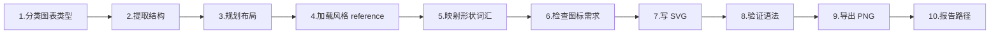
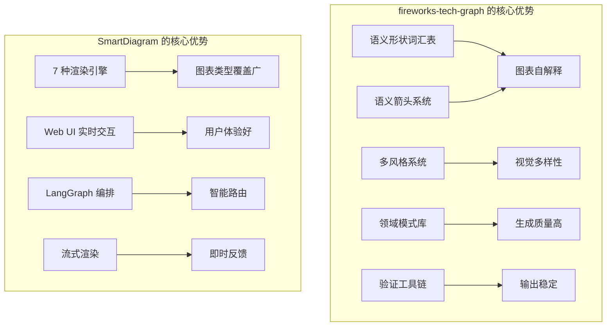

# SmartDiagram vs fireworks-tech-graph 对比分析报告

## 一、项目定位对比

| 维度 | SmartDiagram | fireworks-tech-graph |
|------|-------------|---------------------|
| **本质** | AI 驱动的 Web 绘图平台 | Claude Code 的 Skill 插件 |
| **交互方式** | 浏览器 → 聊天面板 → 画布实时渲染 | 终端对话 → 生成 SVG 文件 → 导出 PNG |
| **渲染引擎** | 5+2 种（Excalidraw、Mermaid、React Flow、ECharts、mind-elixir、Draw.io、Infographic） | 1 种（纯 SVG，手写像素级排版） |
| **后端** | FastAPI + LangGraph Agent 编排 | 无后端，完全依赖 LLM 的 Skill prompt |
| **目标用户** | 非技术人员（Web UI 操作） | 开发者（CLI / 编程助手环境） |

---

## 二、fireworks-tech-graph 的 Skill 创建模式详解

### 2.1 核心架构(文件结构)

```
fireworks-tech-graph/
├── SKILL.md                    # 🎯 主入口 — 定义工作流、图表类型、形状/箭头语义
├── references/
│   ├── style-1-flat-icon.md    # 每种风格的精确色彩 token + SVG 模板
│   ├── style-2-dark-terminal.md
│   ├── style-3-blueprint.md
│   ├── style-4-notion-clean.md
│   ├── style-5-glassmorphism.md
│   ├── style-6-claude-official.md
│   ├── style-7-openai.md
│   └── icons.md                # 40+ 产品图标 SVG + 语义形状
├── fixtures/                   # 回归测试 JSON fixtures
├── scripts/                    # 验证+导出工具链
├── templates/                  # SVG 起始模板
└── assets/samples/             # 示例 PNG
```

### 2.2 十步工作流



### 2.3 三大核心设计系统

#### ① 语义形状词汇表（Shape Vocabulary）

> 形状不仅是好看，而是**编码语义**。

| 概念 | 形状 | 含义 |
|------|------|------|
| LLM / Model | 圆角矩形 + 火花图标 | "这是大模型" |
| Agent / Orchestrator | **六边形** / 双边框矩形 | "主动控制器" |
| Memory (短期) | 虚线边框圆角矩形 | "临时的、会消失的" |
| Memory (长期) | 圆柱体 | "持久化存储" |
| Vector Store | 圆柱体 + 内部网格线 | "向量数据库" |
| Tool / Function | 齿轮图标矩形 | "可调用的工具" |
| Queue / Stream | 横向管道形状 | "消息流" |

#### ② 语义箭头系统（Arrow Semantics）

> 箭头的**颜色 + 虚线模式**编码数据流的含义。

| 流类型 | 颜色 | 虚线 | 含义 |
|--------|------|------|------|
| 主数据流 | 蓝色 `#2563eb` | 实线 | 请求/响应主路径 |
| 控制/触发 | 橙色 `#ea580c` | 实线 | 系统间触发 |
| 内存读取 | 绿色 `#059669` | 实线 | 从存储检索 |
| 内存写入 | 绿色 `#059669` | `5,3` 虚线 | 写入存储 |
| 异步/事件 | 灰色 `#6b7280` | `4,2` 虚线 | 非阻塞事件驱动 |
| 嵌入/转换 | 紫色 `#7c3aed` | 实线 | 数据变换 |
| 反馈/循环 | 紫色 `#7c3aed` | 曲线 | 迭代推理循环 |

#### ③ 多风格系统（Style System）

每种风格都有独立的 reference MD 文件，定义：
- 精确的色彩 token（HEX 值）
- 字体栈和大小规范
- SVG 模板代码（`<rect>`, `<marker>`, `<defs>`）
- 图例样板代码

7 种风格覆盖从文档白底到暗黑终端到毛玻璃到品牌定制。

---

## 三、SmartDiagram 当前 Agent 架构分析

### 3.1 现有引擎矩阵

| 引擎 | Agent 文件 | Prompt 大小 | 输出格式 | 后处理 |
|------|-----------|------------|---------|--------|
| Excalidraw | `excalidraw_agent.py` (214 行) | 中等 — 含元素模板 | JSON Elements | 无 |
| Mermaid | `mermaid_agent.py` (≈160 行) | 轻量 | Mermaid DSL | 无 |
| React Flow | `flow_agent.py` (≈100 行) | 轻量 | JSON nodes/edges | 无 |
| MindMap | `mindmap_agent.py` (≈100 行) | 轻量 | Markdown 标题 | 无 |
| ECharts | `charts_agent.py` (≈90 行) | 轻量 | ECharts option JSON | 无 |
| **Draw.io** | `drawio_agent.py` (**507 行**) | **重量级** — 含形状库+色板+布局规则 | mxGraph XML | ✅ 3 个后处理函数 |
| Infographic | `infographic_agent.py` (≈170 行) | 中等 | AntV DSL | 无 |

### 3.2 路由系统

- `router.py`：三级优先级路由（@tag 显式 → 画布上下文继承 → LLM 意图分类）
- `catalog.py`：Task ↔ Engine 双向映射

---

## 四、可融入 SmartDiagram 的设计理念与具体方案

### 🔥 高价值 — 建议立即融入

#### 1. 语义形状词汇表（Shape Vocabulary）

**现状**：SmartDiagram 的各 Agent prompt 中形状定义分散，`drawio_agent.py` 算做得最好但仅限 Draw.io 引擎。

**方案**：创建一个**全局形状词汇表** `references/shape_vocabulary.md`，让所有 Agent 共享统一的语义映射。当用户说"画一个 Agent 架构"时，无论选择 Excalidraw 还是 Draw.io，Agent 都该用六边形表示 Agent、圆柱体表示数据库。

```
backend/app/references/
├── shape_vocabulary.md      # 语义概念 → 各引擎的具体形状映射
├── arrow_semantics.md       # 箭头颜色/虚线 → 语义含义
└── color_system.md          # 统一色彩语义系统
```

#### 2. 语义箭头系统（Arrow Semantics）

**现状**：`drawio_agent.py` 有 Edge Styles 表但仅按视觉分类（Normal/Primary/Data/Async），缺少语义绑定。

**方案**：引入 fireworks 的「颜色+虚线 = 语义」规则。比如绿色实线一定是"读取"、绿色虚线一定是"写入"。这让图表不仅好看，还能**自解释**。

#### 3. AI 领域内置模式库（Domain Patterns）

**现状**：SmartDiagram 完全依赖 LLM 临场发挥，没有领域知识注入。

**方案**：为常见架构模式（RAG、Multi-Agent、Tool Call Flow 等）创建参考模板，注入到 Agent prompt 中。LLM 生成质量会显著提升。

```python
# 示例：在 drawio_agent 的 prompt 中注入领域模式
DOMAIN_PATTERNS = {
    "RAG Pipeline": "Query → Embed → VectorSearch → Retrieve → LLM → Response",
    "Multi-Agent": "Orchestrator → [SubAgent×N] → Aggregator → Output",
    "Tool Call": "LLM → Tool Selector → Execution → Parser → LLM (loop)",
}
```

---

### 🟡 中价值 — 后续迭代融入

#### 4. 多风格系统

**现状**：SmartDiagram 各引擎只有一种默认风格。

**方案**：为每个引擎定义 2-3 种风格预设（亮色/暗色/蓝图），用户可通过聊天指令切换。优先从 Draw.io 和 Excalidraw 引擎开始。

#### 5. 产品图标库

fireworks-tech-graph 内置了 40+ 产品的品牌色 SVG 图标（OpenAI、Anthropic、PostgreSQL、Kafka 等）。

**方案**：在 Draw.io Agent 的 prompt 中加入常用产品图标的 mxGraph style 映射，让 LLM 在生成架构图时自动使用正确的产品图标和品牌色。

#### 6. 验证与回归测试体系

fireworks-tech-graph 用 fixtures + `validate-svg.sh` 做回归测试。

**方案**：为 SmartDiagram 建立类似的质量保障：
- 每种引擎存储 2-3 个 golden output 作为 fixture
- 添加后处理校验（JSON Schema 校验、Mermaid 语法校验等）

---

### 🟢 低优先级 — 灵感参考

#### 7. SVG 原生引擎

fireworks-tech-graph 完全不依赖任何绘图库，直接生成像素级 SVG。这种方式的优势是**输出完全可控**，但需要极其精细的 prompt 工程。

**评估**：SmartDiagram 已有 7 种引擎，不建议再加 SVG 原生引擎。但其 SVG 布局规则（间距、网格对齐、文字溢出检测）可提炼到现有 Agent 的 prompt 中。

#### 8. Stable Prompt Recipes

fireworks-tech-graph 为每种风格提供了「稳定 prompt 配方」，用户可直接复制获得一致输出。

**方案**：SmartDiagram 可在聊天面板的「模板库」功能中引入类似机制 — 提供预写好的 prompt 模板供用户一键使用。

---

## 五、核心差异总结



## 六、融入优先级建议

| 优先级 | 项目 | 预估工作量 | 影响面 |
|-------|------|-----------|--------|
| P0 | 语义形状词汇表（统一到所有 Agent） | 2-3 天 | 全引擎图表质量提升 |
| P0 | 语义箭头系统 | 1-2 天 | Draw.io + Excalidraw + Flow |
| P1 | AI 领域内置模式库 | 1-2 天 | 架构图生成质量 |
| P1 | 多风格预设 | 3-5 天 | 用户体验差异化 |
| P2 | 产品图标库 | 2-3 天 | 架构图专业度 |
| P2 | 验证回归测试体系 | 2-3 天 | 输出稳定性 |
| P3 | Stable Prompt Recipes → 模板库 | 3-5 天 | 降低用户上手门槛 |
