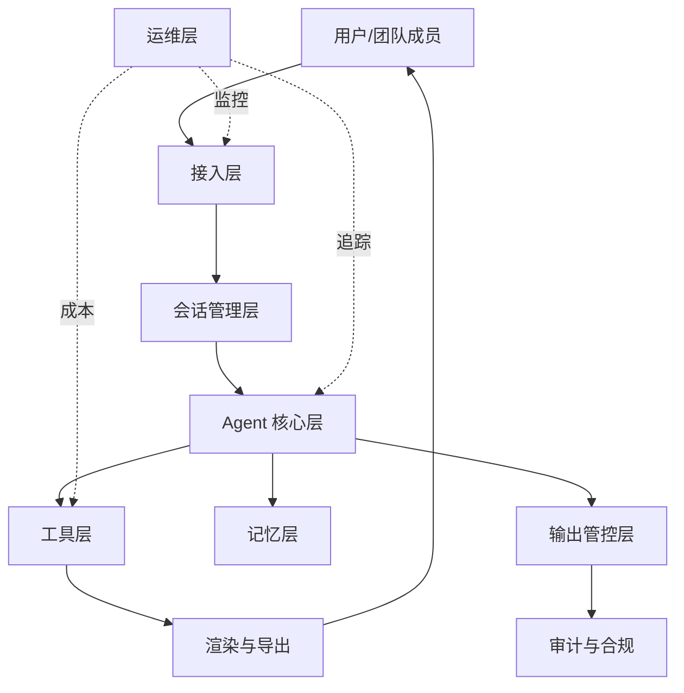
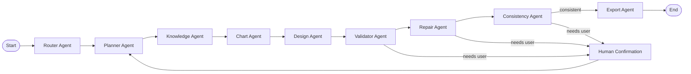
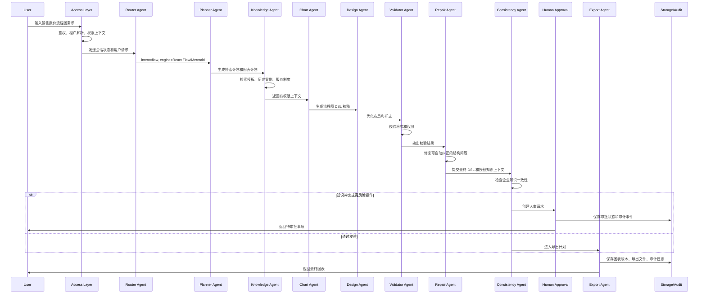

# SmartDiagram 企业级 Agent Platform 架构方案

> 版本：2026-05-26
> 目标：把 SmartDiagram 从自然语言生成图表的个人 Demo，升级为企业内部可用的 Agent Harness / Agent Platform。

## 1. 项目定位

SmartDiagram 当前已经具备多图表引擎、Router Agent、LangGraph 编排和 SSE 流式输出能力。现有链路的核心是：

```text
用户输入 -> Router 识别图表类型 -> 单个绘图 Agent -> 生成 DSL/JSON/XML -> 前端渲染
```

这适合作为 AI 绘图 Demo，但还不等同于企业级 Agent 应用。企业级目标不是“调用模型生成一张图”，而是让系统围绕一个业务目标完成计划、检索、工具调用、校验、修正、版本沉淀和审计。

升级后的定位：

```text
企业内部智能图表 Agent Platform

面向业务流程、系统架构、数据分析、知识沉淀等场景，
基于企业知识库、团队模板和权限边界，
通过多 Agent 协作生成可审计、可复用、可导出的结构化图表。
```

### 1.1 从图表平台扩展到办公 Artifact Platform

图表应该继续作为 SmartDiagram 的第一类产物，但不应该成为 Agent Harness 的上限。更合理的演进方向是把当前系统抽象为：

```text
企业内部智能 Artifact Agent Platform

面向图表、HTML 邮件、HTML 网页分析稿、汇报页、知识摘要等办公产物，
基于企业知识库、团队模板、长期偏好和权限边界，
通过多 Agent 协作生成可审计、可预览、可版本化、可导出的结构化 Artifact。
```

核心变化不是给每个办公场景单独堆一个 Agent，而是把“输出类型”抽象成 Artifact contract：

```text
用户目标 -> Router 识别 artifact_type -> Planner 选择输出契约
 -> Knowledge 检索知识/模板 -> Artifact Agent 生成结构化 DSL
 -> Renderer 确定性渲染 HTML/图表/文件 -> Validator/Repair 校验修复
 -> Version/Export/Audit 沉淀
```

因此：

- 图表是 `artifact_family=diagram`，继续使用 Mermaid、React Flow、ECharts、Draw.io 等渲染器。
- HTML 邮件是 `artifact_family=office`、`artifact_type=html_email`，推荐由结构化 Email DSL 经确定性 renderer 生成邮件 HTML。
- HTML 网页分析稿是 `artifact_family=office`、`artifact_type=web_report_html`，推荐由结构化 Report DSL 经确定性 renderer 生成静态 HTML。
- 第一阶段可以复用现有 `Diagram/DiagramVersion` 兼容层，通过 `metadata_json.artifact_type` 标注办公产物；能力稳定后再迁移到通用 `Artifact/ArtifactVersion` 表。

对 HTML 邮件和网页稿，不建议让模型直接输出任意 HTML。更稳妥的方式是让模型输出受控 JSON DSL，再由系统 renderer 生成 HTML，这样才能做模板复用、权限过滤、内容安全、版本 diff、导出审计和后续 repair。

## 2. 什么时候才算真正的 Agent

SmartDiagram 只有满足以下条件，才算真正的 Agent，而不是 ChatBot 加工具调用：

| 能力 | 普通 ChatBot | 企业级 Agent |
| --- | --- | --- |
| 目标理解 | 回答用户一句话 | 识别业务目标、约束、输出格式和风险 |
| 任务拆解 | 直接生成图表 | 拆成路由、规划、检索、生成、设计、校验、导出 |
| 工具选择 | 固定调用一个工具 | 根据任务动态选择 Mermaid、React Flow、ECharts、Excalidraw、RAG、文件解析、导出工具 |
| 执行反馈 | 只返回最终文本 | 每一步有状态、耗时、错误和重试记录 |
| 状态跟踪 | 依赖聊天历史 | 保存当前任务、图表版本、用户修改意见和执行轨迹 |
| 结果修正 | 用户重新提问 | 根据渲染错误、校验错误、用户反馈进行局部修复 |
| 企业治理 | 依赖 prompt 约束 | 权限过滤、输出校验、审计日志、成本统计、限流降级 |

核心判断标准：

```text
Agent = 目标导向 + 状态机 + 工具编排 + 反馈修正 + 企业治理
```

## 3. 分层架构



### 3.1 接入层

职责：

- 用户入口：Web 控制台、API、企业内嵌组件。
- 登录鉴权：JWT、OAuth、SSO、Supabase Auth。
- 租户隔离：所有请求解析 `tenant_id`。
- 权限控制：RBAC + ABAC，控制图表、项目、知识库和工具调用。
- API 治理：限流、请求大小限制、文件上传限制、SSE/WebSocket 管理。

关键设计：

```text
Request -> Auth Middleware -> Tenant Resolver -> Permission Context -> API Handler
```

每次 Agent 执行都必须携带：

- `tenant_id`
- `user_id`
- `team_id`
- `project_id`
- `role`
- `allowed_tool_scopes`
- `allowed_knowledge_scopes`

### 3.2 会话管理层

职责：

- 保存对话状态。
- 管理上下文窗口。
- 保存当前图表版本。
- 保存用户在本轮会话中的修改意见。
- 将长历史压缩成摘要。

关键对象：

| 对象 | 说明 |
| --- | --- |
| `conversation` | 一次持续对话 |
| `message` | 用户和 Agent 消息 |
| `diagram_version` | 每次图表生成或修改后的版本 |
| `session_state` | 当前执行状态、当前 Agent、当前 DSL |
| `conversation_summary` | 历史压缩摘要 |

当前项目已经在前端 Zustand 中维护了 `messages`、`canvasCode`、`canvasTask`、`canvasEngine`。企业级版本需要把这些状态服务端化，保证刷新、多人协作、审计和恢复。

当前实现已经把服务端短期记忆接入 Agent 执行链路：每次图表版本持久化后，后端会用确定性规则更新 `Conversation.summary` 与 `context_json.short_term_memory`；下一轮 `/chat/stream` 会在构造 LangChain messages 前，按租户和项目权限读取会话摘要、最近消息和当前图表版本，并以 `SHORT-TERM CONVERSATION MEMORY` 只读上下文注入 LangGraph state。摘要不复制完整 DSL，只保存版本指针和用户修改意图，避免上下文膨胀和敏感内容扩散。

版本治理要求：

- 图表版本只追加不覆盖。
- 回滚通过复制历史版本并追加新版本完成。
- 需求变化通过 branch 保留原链路。
- 版本对比通过 deterministic diff 解释 DSL、节点、连线和文本标签变化，便于审计用户反馈带来的结果修正。

### 3.3 Agent 核心层

职责：

- 识别用户意图和图表类型。
- 拆解任务计划。
- 选择工具和 Agent。
- 管理执行状态机。
- 协调多 Agent 协作。
- 管理修复循环和人工确认节点。
- 将高风险或知识冲突结果转化为可追踪的人审请求。

推荐 LangGraph 状态图：



执行状态机：

```text
created
 -> routing
 -> planning
 -> retrieving_context
 -> generating_draft
 -> designing
 -> validating
 -> repairing | human_approval_requested | waiting_user_input | rendering
 -> exporting
 -> completed | failed | cancelled
```

### 3.4 工具层

工具不是简单函数集合，而是受权限、成本和审计约束的能力单元。

| 工具 | 用途 | 输出 |
| --- | --- | --- |
| Mermaid Tool | 标准文档图、时序图、类图、ER 图 | Mermaid DSL |
| Excalidraw Tool | 白板草图、低保真方案 | Excalidraw JSON |
| React Flow Tool | 流程图、Agent 编排图、节点关系图 | nodes/edges JSON |
| ECharts Tool | 数据图表、仪表盘 | ECharts option JSON |
| Draw.io Tool | 企业架构、部署图、拓扑图 | mxGraph XML |
| File Parser Tool | 解析 PDF、Word、Excel、PPT、图片 | 文本、表格、元数据 |
| RAG Tool | 企业知识检索、模板检索、历史案例检索 | 有权限的上下文片段 |
| Business API Tool | CRM、ERP、工单、报价系统 | 业务数据 |
| Office Artifact Renderer | 生成 HTML 邮件、HTML 网页分析稿等办公产物 | 受控 HTML、JSON DSL、导出元数据 |
| Export Tool | 导出 PNG、PDF、PPTX、SVG、JSON | 文件 URL 和元数据 |

工具调用必须记录：

- 谁调用。
- 何时调用。
- 为哪个租户、项目、会话调用。
- 输入摘要。
- 输出摘要。
- 成本和耗时。
- 是否成功。

### 3.5 记忆层

| 类型 | 内容 | 存储位置 | 原因 |
| --- | --- | --- | --- |
| 会话上下文 | 最近消息、当前图表 DSL、用户本轮修改意见 | LangGraph state + Redis | 高频读写、生命周期短 |
| 短期记忆 | 当前会话摘要、当前任务计划、当前版本链 | PostgreSQL | 可恢复、可审计 |
| 长期记忆 | 用户偏好、团队模板、常用图表风格 | PostgreSQL | 结构化、权限明确 |
| 企业知识 | SOP、制度、历史项目、业务术语 | 向量库 + PostgreSQL metadata | 语义检索和权限过滤 |
| 图表资产 | 图片、PDF、PPTX、SVG、JSON 文件 | 对象存储 local/S3/R2 | 大对象不进数据库 |
| 热点缓存 | 模板、权限结果、检索结果 | Redis | 降低延迟和成本 |

短期记忆的当前落地策略：

- `conversations.summary` 保存确定性压缩后的历史摘要。
- `conversations.context_json.short_term_memory` 保存 turn count、最近用户请求、最近 Agent 结果、当前图表版本、引擎和任务类型。
- `messages` 仍然保存原始最近对话，加载时只截断注入最近几轮。
- `diagram_versions.code` 保存完整 DSL，短期记忆只保存 `diagram_version_id` 指针。
- 加载记忆前必须通过 tenant 和 project 访问检查；无权限时不会把历史摘要、消息或版本信息注入模型。

长期偏好记忆的当前落地策略：

- `tenants.settings_json.diagram_preferences` 保存企业默认图表风格。
- `teams.settings_json.diagram_preferences` 保存团队空间默认风格。
- `users.preferences_json.diagram_preferences` 保存用户个人偏好。
- 加载时按 tenant -> team -> user 合并，越靠近用户的偏好优先级越高。
- `/api/preferences/diagram` 提供读取和更新接口，读取需要 `preference:read`，写入需要 `preference:write`，租户级写入还需要 admin/owner 角色。
- 前端聊天头部提供图表偏好面板，用户可以维护个人或团队级流程图/数据图表偏好，并和 Agent 请求共享同一套 tenant、team、role、scope 上下文。
- `/chat/stream` 会把授权后的合并偏好放入 `memory_context.long_term_preferences`，并向图表 Agent Prompt 注入 `AUTHORIZED LONG-TERM DIAGRAM PREFERENCES`。
- Design Agent 当前能把长期偏好确定性应用到 React Flow 的边颜色、边宽、节点圆角等样式，以及 ECharts 的 palette 和 background。

历史图表记忆的当前落地策略：

- `GET /api/diagrams/history` 按租户和项目权限检索历史图表。
- 检索支持 `query`、`engine_type`、`task_type`、`include_code`、`limit`。
- 返回图表元数据、当前版本、会话摘要、代码 hash、默认截断的代码预览，以及可审计的 `agent_process`。
- `agent_process` 通过 `messages.metadata_json.agent_run_id` 关联 `agent_runs.execution_steps_json`，包含 run id、assistant 结果、可见执行步骤、每步耗时、总耗时、token 估算和成本估算。
- 分支和回滚版本会尽量追溯到源版本的原始 Agent 运行过程；这里保存的是产品可见执行轨迹，不保存或暴露隐藏 chain-of-thought。
- 项目图表必须通过 project membership 的 `diagram:read` 校验；无项目的私有图表只允许 owner 或 tenant admin 读取。
- 每次检索写入 `diagram.history.searched` 审计事件，记录过滤条件和结果数量。
- Knowledge Agent 会在企业知识和模板检索之外，按权限召回最多 3 个历史图表，写入 `memory_context.knowledge.historical_diagrams`。
- 图表 Agent Prompt 会收到 `AUTHORIZED HISTORICAL DIAGRAMS` 区块，只包含会话摘要、设计说明和截断代码预览，避免直接把全租户历史塞入模型。
- 前端聊天头部提供历史图表面板，用户可以搜索授权历史图表，并把历史版本一键载入当前画布，或基于历史版本创建新分支继续编辑。

向量库只负责召回，不负责授权。每个知识 chunk 必须带：

```text
tenant_id
project_id
team_id
source_doc_id
acl
classification
created_by
```

检索流程：

```text
用户问题 -> 权限上下文 -> 模板检索 -> metadata filter -> vector search -> ACL 二次过滤 -> 注入 prompt
```

模板治理：

- `diagram_templates` 保存团队、项目和租户级标准图表骨架。
- 模板带 `engine_type`、`task_type`、`priority`、`tags`、`acl` 和 `template_code`。
- Knowledge Agent 在知识检索阶段按权限和相关性选择模板。
- Chart Agent 将模板作为结构化起点，而不是无约束自由生成。

### 3.6 输出管控层

职责：

- 校验模型输出格式。
- 检查图表 DSL 能否渲染。
- 检查是否引用了无权限知识。
- 检查是否和企业知识冲突。
- 检查是否包含敏感内容。
- 记录审计日志。

关键校验：

| 输出类型 | 校验方式 |
| --- | --- |
| Mermaid | Mermaid parser 或 headless render |
| ECharts | JSON Schema + 禁止 JS 函数 |
| React Flow | nodes/edges schema + id 引用一致性 |
| Excalidraw | element schema + 坐标和尺寸约束 |
| Draw.io | XML parse + mxGraph 结构检查 |
| HTML Email | JSON DSL schema + 禁止脚本/表单/事件属性 + 链接策略 + 邮件客户端约束 |
| Web Report HTML | JSON DSL schema + 静态 HTML policy + sandbox preview + 外链策略 |
| Export | 文件生成成功、权限可访问、对象存储写入成功 |

### 3.7 运维层

企业级系统必须具备：

- 结构化日志。
- OpenTelemetry-style trace；当前实现会记录 LangGraph 节点 span、父子关系、耗时和脱敏属性。
- 每次 Agent run 的 step trace，可通过审计 API 按 run 查询。
- Token 成本统计。
- 用户、团队、租户维度配额；当前实现以租户月度成本/token 预算作为硬护栏，并用 usage rollup 与可配置后台维护任务支撑大租户指标查询。
- 工具失败率监控。
- 模型延迟监控。
- 异常追踪。
- 限流和降级策略；当前实现支持本地内存限流和可选 Redis 共享限流，适配单实例开发与多实例部署。
- 应用内 Agent Ops 看板展示 run、成本、预算、审计事件、待审批请求和 trace span。
- 前端企业面板使用应用内 `TextInputDialog`、`ConfirmDialog` 和 `NoticeDialog`，避免浏览器原生 prompt/confirm/alert 破坏品牌体验；关键企业 UI、设置弹窗和画布主界面文案通过轻量 i18n 支持中文和英文，并在本地保留用户选择的语言。

## 4. 标准 Agent 工作流

示例：用户提出“帮我生成一个销售报价流程图”。



## 5. 多 Agent 职责

| Agent | 输入 | 输出 | 工具 | 状态 | 失败兜底 |
| --- | --- | --- | --- | --- | --- |
| Router Agent | 用户消息、当前画布类型、历史上下文 | `intent`、`task_type`、`engine_type` | 关键词规则、LLM 分类 | `routing` | 不确定时让用户选择，或沿用当前引擎 |
| Planner Agent | 意图、权限、目标格式、当前图表 | 任务计划、工具计划 | LangGraph state、模板目录 | `planning` | 简化计划，跳过非必要步骤 |
| Knowledge Agent | 检索词、租户、项目、权限 | 模板、知识片段、历史案例 | RAG、文件解析、业务 API | `retrieving_context` | 无结果时使用通用模板并标记未引用知识库 |
| Chart Agent | 任务计划、知识上下文、图表类型 | Mermaid/ECharts/React Flow/Excalidraw DSL | LLM、结构化输出 | `generating_draft` | 切换更简单图表引擎或局部修复 |
| Design Agent | 图表 DSL、品牌规范、用户偏好 | 优化后的布局和样式 | 主题系统、自动布局 | `designing` | 使用企业默认主题 |
| Validator Agent | DSL、权限上下文、引用来源 | 校验报告、修复建议 | JSON Schema、parser、policy engine | `validating` | 自动修复有限次数，失败返回可解释错误 |
| Repair Agent | 校验报告、原始 DSL、引擎类型 | 修复后的 DSL、修复报告 | deterministic repair rules、schema patcher | `validating` | 无法修复时保留原错误并要求用户确认 |
| Consistency Agent | 最终 DSL、授权知识上下文 | 一致性报告、冲突项、确认要求 | 约束解析、引用检查、policy engine | `validating` | 知识冲突时停止自动导出并要求确认 |
| Human Approval Gateway | 冲突报告、导出风险、图表版本、权限上下文 | 待审批请求、审批决定、审计事件 | Approval API、Audit API、RBAC/ABAC | `human_approval_requested` | 无审批权限时拒绝操作，过期或拒绝后要求用户修改 |
| Export Agent | 最终图表和导出格式 | PNG、PDF、PPTX、SVG、JSON | Headless browser、PPTX、S3/R2 | `exporting` | 降级为 SVG/JSON 或异步导出 |

## 6. 权限与隔离

权限维度：

- 多租户：所有业务表和知识库 metadata 都带 `tenant_id`。
- 用户角色：Owner、Admin、Editor、Viewer、Guest。
- 团队空间：团队模板、团队知识库、团队历史图表。
- 项目权限：项目内会话、图表、导出文件。
- 图表访问权限：private、team、project、tenant。
- 企业知识库权限：文档和 chunk 都带 ACL。
- 工具调用权限：业务 API、高成本模型、导出格式按角色控制。
- 导出权限：高清图、PDF、PPTX、无水印导出可单独授权。
- 人工确认边界：PDF/PPTX 等可外发、高传播性的格式默认需要二次确认，未确认请求只记录审计，不创建导出资产。
- 审批权限：`approval:read` 控制查看待审批事项，`approval:write` 控制创建和处理人审请求；审批记录同样按租户、项目和图表版本隔离。

防越权原则：

```text
检索前过滤 -> 检索后校验 -> 生成前裁剪 -> 输出前审查 -> 全链路审计
```

## 7. 失败场景和兜底

| 失败场景 | 兜底策略 |
| --- | --- |
| 工具调用失败 | 超时、重试、熔断，必要时切备用工具 |
| LLM 输出格式错误 | JSON Schema 校验，带错误信息自动修复 |
| Mermaid 或 JSON 渲染失败 | parser 错误回灌给 Chart Agent，最多修复 2 次 |
| 上下文过长 | 会话摘要 + 当前图表完整 DSL + RAG 检索 |
| 用户目标不断变化 | 建立 task branch，保留旧版本；当前实现用分支 API 创建新 Diagram，用回滚 API 追加新版本而非覆盖历史，并用 diff API 解释版本差异 |
| 与知识库不一致 | 标记冲突，创建 `HumanApprovalRequest`，审批通过前不自动进入导出 |
| 权限不足 | 不检索、不注入、不输出，返回申请权限入口 |
| Token 成本过高 | 单请求预算拒绝、租户月度预算 HTTP 402、小模型路由、缓存、模板优先、分阶段调用 |
| 响应时间过长 | 流式状态先返回，导出异步化 |
| 多 Agent 循环调用 | 最大步数、最大重试、状态机禁止无条件回环 |

## 8. 关键 Tradeoff

| 取舍 | 建议 |
| --- | --- |
| 准确率 vs 成本 | Router/Validator 用小模型，Chart/Planner 用强模型 |
| 多 Agent 协作 vs 延迟 | 简单请求走 fast path，复杂任务进入完整多 Agent |
| 长上下文 vs RAG | 当前图表完整保留，历史消息摘要化，知识走 RAG |
| 自动执行 vs 人工确认 | JSON/SVG/PNG 可自动导出，PDF/PPTX 等外发格式必须确认后执行 |
| 通用图表生成 vs 企业模板约束 | 默认优先企业模板；模板无权限或无匹配时保留自由生成模式 |
| 流式输出 vs 完整校验 | 流式展示过程，最终版本必须校验后入库 |
| 复杂规划 vs 简单规则路由 | 80% 请求规则路由，复杂任务再规划 |

## 9. 推荐实施路线

1. Agent Harness 基座：扩展状态、步骤、执行计划、审计事件。
2. 多 Agent 状态图：从 `Router -> Agent -> END` 升级为可插拔节点。
3. 输出校验：先做 Mermaid、ECharts、React Flow 的 schema 和 parser 校验。
4. 持久化：落库 conversation、message、diagram_version、agent_run、tool_call。
5. 企业权限：接入 tenant、team、project、role、ACL。
6. RAG：文档上传、解析、chunk、embedding、权限过滤检索。
7. Artifact 抽象：把图表、HTML 邮件、HTML 网页分析稿统一为结构化 Artifact contract，先通过兼容层落库，后续迁移到通用 Artifact 表。
8. 导出：PNG、SVG、PDF、PPTX、JSON、HTML，产物进入 S3/R2。
9. 运维：OpenTelemetry-style trace、成本统计、限流、降级、错误追踪。

## 10. 面试讲述版本

SmartDiagram 最初是一个自然语言生成图表的 AI 工具，用户输入一句话，系统通过 Router 判断使用 Mermaid、Excalidraw、React Flow、ECharts 等引擎，然后生成对应 DSL 并渲染。

我发现如果要面向企业内部使用，普通 ChatBot 不够。企业用户需要的不是一次性生成，而是基于企业知识、团队模板、权限边界和历史版本，稳定地产出可审计、可修改、可导出的业务图表。

所以我把它设计成 Agent Harness / Agent Platform。核心是用 LangGraph 将单次调用升级为状态机：Router Agent 识别意图，Planner Agent 拆解任务，Knowledge Agent 检索企业知识和历史模板，Chart Agent 生成结构化图表 DSL，Design Agent 优化布局，Validator Agent 校验格式和权限，Repair Agent 修复常见结构错误，Consistency Agent 检查企业知识一致性，Human Approval Gateway 把冲突和高风险动作转成可审批 checkpoint，Export Agent 负责导出文件。

在记忆系统上，我把当前会话、图表 DSL 和用户反馈放在短期记忆里，把用户偏好、团队模板、企业知识和历史图表放在长期记忆里。结构化数据进入 PostgreSQL，当前本地 RAG 会先把向量持久化在数据库记录里，也可以通过 `KNOWLEDGE_VECTOR_BACKEND=pgvector` 切换到 Postgres 原生近邻检索，或通过 `KNOWLEDGE_VECTOR_BACKEND=qdrant` 切换到专用 Qdrant 向量库；更大规模时再评估 Milvus。大文件通过对象存储 abstraction 进入 local/S3/R2，执行状态和缓存进入 Redis。知识库上下文进入模型前会经过可配置安全策略引擎，当前以规则为主，预留 ML/rule hybrid 分类器接入点。

在企业治理上，我设计了多租户、团队空间、项目权限、知识库 ACL、工具调用权限和导出权限。RAG 检索不是直接按相似度召回，而是先按租户和权限过滤，再做二次 ACL 校验，最后才能注入给模型。

这个项目体现了多 Agent 协作、LangGraph 状态机、工具调用治理、结构化输出校验、RAG 权限过滤、短期和长期记忆、版本管理、审计日志、成本控制和失败兜底等 AI Agent 工程能力。它从个人 Demo 升级成了企业可落地的 Agent 应用平台。
