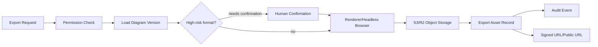

# Enterprise Export System Implementation Plan

**Goal:** 为 SmartDiagram 增加企业级导出系统，支持 PNG、SVG、PDF、PPTX、JSON，并将导出资产纳入权限、对象存储、版本和审计。

**Architecture:** 前端继续负责即时画布预览，后端提供可审计的导出任务。导出任务读取图表版本 DSL，调用对应 renderer/headless browser，生成文件后写入 S3/R2，并返回带权限控制的 asset record 和 signed URL。

---

## Export Pipeline



## Data Model

新增表建议：

| Table | Purpose |
| --- | --- |
| `export_jobs` | 异步导出任务 |
| `export_assets` | 导出文件资产 |
| `export_presigned_urls` | 可选，记录短期下载链接 |

核心字段：

```text
tenant_id
project_id
diagram_id
diagram_version_id
requested_by
format
status
storage_key
mime_type
file_size
expires_at
created_at
```

## Supported Formats

| Format | Strategy |
| --- | --- |
| JSON | Return original normalized DSL or engine payload |
| SVG | Mermaid/Draw.io/Excalidraw/DOM renderer output |
| PNG | Headless browser screenshot or renderer canvas export |
| PDF | Render SVG/HTML to PDF through browser/PDF engine |
| PPTX | Use `python-pptx`, one diagram per slide or selected template |

## Task 1: Add export models

**Files:**

- Create: `backend/app/models/export.py`
- Modify: `backend/app/core/db.py`

**Steps:**

1. Add `ExportJob` and `ExportAsset`.
2. Import `export` before `SQLModel.metadata.create_all`.
3. Verify:

```bash
cd backend && python3 -m py_compile app/models/export.py app/core/db.py
uv run python -c "from sqlmodel import SQLModel; from app.models import export; print(sorted(SQLModel.metadata.tables.keys()))"
```

## Task 2: Add object storage service

**Files:**

- Create: `backend/app/services/object_storage.py`

**MVP:**

- Local filesystem storage under `backend/storage/exports`.

**Enterprise:**

- S3/R2 adapter with:
  - `put_object`
  - `get_signed_url`
  - `delete_object`
  - `head_object`

Storage key format:

```text
tenants/{tenant_id}/projects/{project_id}/diagrams/{diagram_id}/versions/{version_id}/exports/{asset_id}.{ext}
```

## Task 3: Add export permission checks

**Files:**

- Modify: `backend/app/services/permission_service.py`

Rules:

- `export:basic` allows JSON/SVG/PNG.
- `export:pdf` allows PDF.
- `export:pptx` allows PPTX.
- `EXPORT_CONFIRMATION_REQUIRED_FORMATS` defaults to `pdf,pptx`; these formats must be resubmitted with `confirmed=true` after a user confirmation.
- Project viewer can export only if diagram visibility allows read.
- Guest cannot export enterprise knowledge citations unless explicitly scoped.

## Task 4: Add export API

**Files:**

- Create: `backend/app/api/routes_exports.py`
- Modify: `backend/app/main.py`

Endpoints:

```text
POST /api/diagrams/{diagram_id}/versions/{version_id}/exports
GET  /api/export-jobs/{job_id}
GET  /api/export-assets/{asset_id}/download-url
```

## Task 5: Add backend renderers

**Files:**

- Create: `backend/app/services/export_renderers.py`

Renderer strategy:

- Mermaid: use headless browser and Mermaid runtime.
- ECharts: render in headless browser and screenshot.
- React Flow: render preview shell and screenshot.
- Excalidraw: use front-end compatible export when possible; fallback to browser.
- Draw.io: store XML plus SVG/PNG render if renderer available.
- Mindmap: render markdown mindmap in browser shell.

## Task 6: Add PPTX export

**Files:**

- Create: `backend/app/services/pptx_exporter.py`

Policy:

- Use `python-pptx`.
- One diagram per slide.
- Include title, subtitle, generated image, citations, and footer metadata.
- Store final PPTX as export asset.

## Task 7: Wire Export Agent

**Files:**

- Create: `backend/app/agents/export_agent.py`
- Modify: `backend/app/agents/orchestrator.py`

Behavior:

- Accept final diagram version and requested formats.
- Check permission.
- Create export job.
- Return immediate job id for slow formats.
- Stream completion event when available.

## Execution Update - 2026-05-26

已完成的 MVP 闭环：

- Added export data models: `ExportJob`, `ExportAsset`, `ExportPresignedURL`.
- Added local object storage under `backend/storage/exports`, with generated files ignored by Git.
- Added export API routes for creating jobs, checking jobs, issuing download URLs, and downloading assets.
- Added permission checks for `export:basic`, `export:pdf`, and `export:pptx`.
- Added deterministic local renderers for JSON, SVG, PNG, PDF, and PPTX.
- Wired frontend export button to prefer versioned backend export when a persisted diagram version exists.
- Added `npm run db:up`, `npm run db:down`, and `npm run smoke:enterprise`.
- Added project-level read checks for export job creation, job status, download URL, and asset download.
- Added project-scoped audit querying for export events.

Verified against Docker PostgreSQL:

```bash
npm run db:up
npm run smoke:enterprise
```

Smoke result:

```text
json: 1086 bytes
svg: 1566 bytes
png: 20595 bytes
pdf: 1396 bytes
pptx: 28837 bytes
authorized_export_jobs=5
audit_events=5
OK: enterprise persistence/export smoke passed
```

## Audit Requirements

Every export must record:

- actor user id
- tenant id
- project id
- diagram/version id
- export format
- storage key
- download URL generation
- success/failure

## Acceptance Criteria

- Export requests are denied without the required scope.
- JSON/SVG/PNG basic export works in local dev.
- Export assets are stored under deterministic object keys.
- Export asset records are linked to diagram versions.
- Audit events are written for export creation and download URL generation.

## Execution Update - 2026-05-26 S3/R2 Object Storage Adapter

Implemented:

- Object storage is now selected through `OBJECT_STORAGE_BACKEND=local|s3|r2`.
- Added an S3/R2-compatible adapter using AWS Signature Version 4 with standard-library PUT/GET/HEAD/DELETE and presigned GET URL support.
- Export jobs now write through the object storage factory instead of constructing `LocalObjectStorage` directly.
- Export asset metadata records `storage_backend` for audit/debug visibility.
- Download URL issuance returns the app proxy URL for local storage and storage-native signed URLs for S3/R2.
- Docker Compose and `.env.example` expose S3/R2 configuration variables.
- `smoke:enterprise` verifies local storage metadata and offline S3/R2 presigned URL generation.

## Execution Update - 2026-05-26 Presigned URL Persistence

Implemented:

- Download URL issuance now writes `ExportPresignedURL` records with `url_hash`, `requested_by`, and `expires_at`.
- `GET /api/export-assets/{asset_id}/download-url` accepts bounded `expires_in` and returns `presigned_url_id` plus `expires_at`.
- Download URL audit events include the persisted presigned URL id and expiry timestamp.
- `smoke:enterprise` verifies that every generated export download URL has a persisted `ExportPresignedURL` row.

## Execution Update - 2026-05-26 Async Export Worker Boundary

Implemented:

- Export rendering and object storage are now handled by `process_export_job`, which opens its own database session and can run inline or as a background task.
- `POST /api/diagrams/{diagram_id}/versions/{version_id}/exports` supports `mode=async`, `async=true`, `async_export=true`, or `background=true`.
- Async export requests return a queued job immediately and process the export through FastAPI background tasks in local/dev deployments.
- `GET /api/export-jobs/{job_id}` is used to poll final status and `result_asset_id`.
- `smoke:enterprise` verifies a queued async export reaches `completed` and produces an asset.

## Execution Update - 2026-05-26 DB-Backed Export Worker

Implemented:

- Added `mode=queued` for export creation so API requests can create durable queued jobs without running FastAPI background tasks.
- Added `run_pending_export_jobs_once` to process queued export jobs from PostgreSQL state.
- Added `scripts/run_enterprise_workers.py` as a lightweight local worker entry point for exports, DB-backed knowledge ingestion, and Redis-backed knowledge ingestion.
- Added `npm run worker:once`, `npm run worker`, and an optional Docker Compose `worker` profile for local/dev deployment parity.
- `smoke:enterprise` verifies a queued export remains queued until the worker helper processes it, then produces the expected export asset.

## Execution Update - 2026-05-26 Human Confirmation Boundary

Implemented:

- Added `EXPORT_CONFIRMATION_REQUIRED_FORMATS`, defaulting to `pdf,pptx`.
- `POST /api/diagrams/{diagram_id}/versions/{version_id}/exports` now returns `409` with `reason=export_confirmation_required` when a high-risk format is requested without `confirmed=true`.
- Unconfirmed high-risk requests do not create export jobs or assets; they only write an `export.confirmation.required` audit event after tenant, project, and scope checks pass.
- Confirmed high-risk requests write `export.confirmation.accepted`, persist confirmation metadata on the export job options, and then continue through the normal export pipeline.
- The frontend enterprise export path prompts the user when the API returns confirmation-required and resubmits only after explicit confirmation.
- `smoke:enterprise` verifies PDF/PPTX are blocked without confirmation, succeed with confirmation, and leave confirmation audit records.
