# Enterprise Ops Guardrails Implementation Plan

**Goal:** 为 SmartDiagram Agent Harness 增加企业运维护栏，包括限流、成本估算、请求降级、循环保护、错误追踪和审计指标。

**Architecture:** 在请求进入 LangGraph 前执行 deterministic guard。通过本地内存限流和 token/cost 估算保护开发环境；生产环境可将限流状态替换为 Redis。所有护栏决策写入 AgentRun 和 AuditEvent，供审计 API 聚合。

## Guardrail Pipeline

```mermaid
flowchart LR
  Request[Chat Request] --> Estimate[Token/Cost Estimate]
  Estimate --> RateLimit[Rate Limit]
  RateLimit --> Budget[Tenant Monthly Budget]
  Budget --> Degrade[Degrade If Large]
  Degrade --> Graph[LangGraph Execution]
  Graph --> LoopGuard[Stream/Loop Guard]
  LoopGuard --> Audit[AgentRun + AuditEvent]
  Audit --> Metrics[Audit Metrics API]
```



## Task 1: Runtime guard service

**Files:**

- Create: `backend/app/services/runtime_guard_service.py`
- Modify: `backend/app/core/config.py`
- Modify: `backend/.env.example`

**Behavior:**

- Estimate input/output tokens before model execution.
- Estimate cost from configurable per-1K token prices.
- Rate-limit by `tenant_id:user_id`.
- Reject requests above `RUNTIME_MAX_ESTIMATED_TOKENS`.
- Mark large but acceptable requests as degraded.
- Detect runaway event streams and repeated Agent nodes.

## Task 2: Wire guard into chat stream

**Files:**

- Modify: `backend/app/api/routes.py`
- Modify: `backend/app/services/audit_service.py`

**Behavior:**

- Return HTTP 429 for rate-limited requests.
- Return HTTP 413 for estimated token budget overflow.
- Force concise detail mode when degradation triggers and the user did not explicitly choose a detail level.
- Emit a `runtime_guard` SSE event.
- Persist estimated token usage and cost on `AgentRun`.
- Persist `runtime.guard.evaluated`, `runtime.degraded`, and `runtime.loop_guard.triggered` audit events.

## Task 3: Add operational metrics API

**Files:**

- Modify: `backend/app/api/routes_audit.py`
- Create: `backend/app/models/usage.py`
- Create: `backend/app/services/budget_service.py`

**Endpoint:**

```text
GET /api/audit/metrics
GET /api/audit/prometheus
```

**Output:**

- Agent run totals by status and engine.
- Estimated input/output tokens.
- Estimated cost.
- Audit event totals by type and severity.
- Tenant monthly budget limit, current usage, projected usage and remaining quota for tenant admins.
- Prometheus text exposition for scrape-style monitoring.

## Task 4: Add smoke coverage

**Files:**

- Create: `backend/scripts/smoke_runtime_guards.py`
- Modify: `backend/scripts/smoke_enterprise_flow.py`
- Modify: `package.json`

**Commands:**

```bash
npm run smoke:runtime
npm run smoke:budget
npm run smoke:ops
npm run smoke:enterprise
```

## Task 5: Add Agent graph tracing

**Files:**

- Create: `backend/app/services/agent_trace_service.py`
- Modify: `backend/app/models/audit.py`
- Modify: `backend/app/api/routes.py`
- Modify: `backend/app/api/routes_audit.py`
- Modify: `backend/scripts/smoke_ops_metrics.py`

**Behavior:**

- Record OpenTelemetry-style spans for LangGraph chain and chat-model lifecycle events.
- Preserve `trace_id`, `span_id`, `parent_span_id`, node name, span type, status, duration and sanitized attributes.
- Persist spans under tenant/project/run isolation.
- Expose `GET /api/audit/agent-runs/{run_id}/trace` behind the same `audit:read` authorization boundary.
- Avoid persisting raw prompt, retrieved chunks or full model output in span attributes.

## Task 6: Add usage rollups for large tenants

**Files:**

- Modify: `backend/app/models/usage.py`
- Modify: `backend/app/services/budget_service.py`
- Modify: `backend/app/api/routes_audit.py`
- Modify: `backend/scripts/smoke_tenant_budget.py`

**Behavior:**

- Keep budget hard-limit checks on live `AgentRun` aggregation to avoid stale quota decisions.
- Add `TenantUsageRollup` for pre-aggregated tenant/project usage.
- Add `POST /api/audit/usage-rollups/refresh` for tenant admins or project-scoped operators.
- Make audit metrics prefer rollup usage when a refreshed rollup exists.
- Include usage source metadata so dashboards can distinguish live aggregation from rollup reads.

## Task 7: Add audit and cost dashboard

**Files:**

- Create: `frontend/src/components/ops/OpsDashboard.tsx`
- Modify: `frontend/src/components/chat/ChatPanel.tsx`
- Modify: `README.md`

**Behavior:**

- Add an in-app Agent Ops dashboard entry point in the right sidebar header.
- Read `GET /api/audit/metrics` for Agent run totals, estimated cost, token usage, audit events and budget usage.
- Read `GET /api/audit/agent-runs` and `GET /api/audit/agent-runs/{run_id}/trace` for recent run and span inspection.
- Call `POST /api/audit/usage-rollups/refresh` so operators can refresh local-dev rollups from the UI.
- Keep dashboard data behind the same audit API permission boundary.

## Task 8: Add Redis-backed rate limiting

**Files:**

- Modify: `backend/app/services/runtime_guard_service.py`
- Modify: `backend/app/api/routes.py`
- Modify: `backend/app/core/config.py`
- Modify: `docker-compose.yml`
- Modify: `backend/scripts/smoke_runtime_guards.py`

**Behavior:**

- Keep `memory` as the default local-dev limiter.
- Add `redis` as an optional shared limiter for multi-instance deployments.
- Use an atomic Redis sliding-window script so concurrent API workers share the same tenant/user limit.
- Return HTTP 503 when Redis is selected but unavailable, unless explicit fail-open fallback is enabled.
- Include the active rate-limit backend in the runtime guard event for audit/debug visibility.

## Execution Update - 2026-05-26

Implemented:

- Runtime guard service with local rate limiting, budget checks, cost estimation, degradation, and loop protection.
- Chat stream integration with HTTP 429/413 guard responses and runtime SSE event.
- AgentRun token/cost persistence.
- Audit metrics endpoint.
- Prometheus metrics endpoint.
- Smoke coverage for rate limiting, budget overflow, degradation, loop guard, export metrics, and audit events.

Verified:

```bash
python3 -m compileall -q app scripts
npm run smoke:runtime
npm run smoke:enterprise
```

## Execution Update - 2026-05-26 Tenant Budget

Implemented:

- `TenantUsageBudget` table for tenant/month budget boundaries.
- Budget service for current period detection, AgentRun usage aggregation, projected request checks, and metrics snapshots.
- Chat stream budget guard with HTTP 402 rejection before LangGraph execution.
- `budget_guard` SSE event and `tenant.budget.evaluated` / `tenant.budget.rejected` audit events.
- Audit metrics budget section with tenant-wide visibility for tenant admins and project-scoped hiding for non-admin project users.
- `smoke:budget` coverage for allowed projection, over-budget rejection, chat pre-run rejection, and metrics budget snapshot.

## Execution Update - 2026-05-26 Prometheus Metrics

Implemented:

- `GET /api/audit/prometheus` with Prometheus text exposition format.
- Metrics for Agent run counts, estimated tokens, estimated cost, audit events, and budget usage/limits.
- Reused existing `audit:read`, tenant, and project authorization checks.
- `smoke:ops` coverage for JSON metrics, Prometheus output, and permission denial without `audit:read`.

## Execution Update - 2026-05-26 Agent Trace Spans

Implemented:

- `AgentTraceSpan` persistence model for OpenTelemetry-style graph spans.
- `AgentTraceRecorder` that observes LangGraph stream events and records chain/chat-model spans with parent-child relationships and sanitized attributes.
- Chat stream integration so completed and failed Agent runs persist trace spans with the run.
- `GET /api/audit/agent-runs/{run_id}/trace` for project-scoped trace inspection behind `audit:read`.
- `smoke:ops` coverage for trace span persistence, expected graph nodes, parent span relationships, and permission denial.

## Execution Update - 2026-05-26 Usage Rollups

Implemented:

- `TenantUsageRollup` table for tenant/project pre-aggregated usage.
- Budget service refresh logic that aggregates `AgentRun` cost, tokens, run counts and status counts into rollups.
- Audit refresh endpoint: `POST /api/audit/usage-rollups/refresh`.
- Metrics snapshots now prefer rollup usage when available, while budget hard-limit evaluation keeps live aggregation to avoid stale rejections/allowances.
- Prometheus budget usage labels include `source=rollup|agent_runs`.
- `smoke:budget` coverage for live metrics before refresh and rollup-backed metrics after refresh.

## Execution Update - 2026-05-26 Ops Dashboard

Implemented:

- In-app `Agent Ops` dashboard launched from the chat header.
- Dashboard metrics for Agent runs, estimated cost, token usage, audit events, budget limits and usage source.
- Recent Agent run list with trace span inspection.
- Rollup refresh action wired to `POST /api/audit/usage-rollups/refresh`.
- Dashboard reuses the existing audit API permission boundary.

## Execution Update - 2026-05-26 Rollup Maintenance Scheduler

Implemented:

- In-process usage rollup maintenance scheduler for local/dev deployments.
- Optional startup refresh controlled by `USAGE_ROLLUP_REFRESH_ON_STARTUP`.
- Optional periodic refresh controlled by `USAGE_ROLLUP_SCHEDULER_ENABLED` and `USAGE_ROLLUP_REFRESH_INTERVAL_SECONDS`.
- FastAPI startup/shutdown lifecycle integration so the scheduler only starts after database initialization succeeds.
- Current-period tenant budget row maintenance, acting as the local quota reset boundary.
- `smoke:budget` coverage for the one-shot maintenance job in addition to manual refresh endpoint coverage.

## Execution Update - 2026-05-26 Redis Rate Limiter

Implemented:

- Optional Redis-backed runtime rate limiter for multi-instance deployments.
- Async runtime guard path used by the FastAPI chat endpoint.
- Redis sliding-window enforcement through an atomic Lua script over the Redis wire protocol.
- Config flags: `RUNTIME_RATE_LIMIT_BACKEND`, `REDIS_URL`, and `RUNTIME_RATE_LIMIT_REDIS_FAIL_OPEN`.
- Docker Compose Redis service for local enterprise infrastructure testing.
- `smoke:runtime` coverage for async guard behavior and Redis fail-open fallback.

## Execution Update - 2026-05-26 Queue Health Observability

Implemented:

- Added queue health snapshots for export jobs and knowledge ingestion jobs using PostgreSQL job state.
- Added `GET /api/audit/queue-health` behind the existing `audit:read` authorization boundary.
- Audit JSON metrics now include queue totals, per-queue status counts, oldest queued age, running age, and latest failure timestamp.
- Prometheus output now includes `smartdiagram_queue_jobs` and `smartdiagram_queue_oldest_queued_age_seconds`.
- The Agent Ops dashboard now surfaces queued, running, and failed worker jobs.
- `smoke:ops` verifies queued export and knowledge jobs appear in JSON metrics, queue-health API, Prometheus output, and are denied without `audit:read`.

## Execution Update - 2026-05-26 Stale Worker Job Recovery

Implemented:

- Added stale running-job detection to queue health snapshots using `WORKER_STALE_JOB_TIMEOUT_SECONDS`.
- Added `recover_stale_worker_jobs_once` to recover export and knowledge ingestion jobs stuck in `running` after worker crashes.
- Recovery supports `WORKER_STALE_JOB_ACTION=requeue|fail`; default is `requeue` so jobs can be retried by the next worker pass.
- Recovered jobs record recovery metadata on the job row and emit `worker.job.recovered` audit events.
- `scripts/run_enterprise_workers.py` runs stale recovery before processing queues by default, with CLI overrides for action and timeout.
- `smoke:ops` verifies stale export and knowledge jobs are detected, exposed in metrics, requeued by recovery, and no longer counted as stale.

## Execution Update - 2026-05-26 Agent Execution Steps

Implemented:

- Added execution step aggregation that merges the declared execution plan, LangGraph trace spans, Agent audit events, validation events, and tool-call records into stable Agent Harness steps.
- `AgentRun.execution_steps_json` now records business-level steps such as `router`, `planner`, `knowledge`, `chart`, `designer`, `validator`, `repair`, `consistency`, and `export`, including status, phase, duration, errors, related span ids, audit events, validation events, and tool-call summaries.
- Tool calls emitted by Planner, Design, Validator, and Export agents are now persisted to the `tool_calls` table with tenant/project/run isolation.
- Added `GET /api/audit/agent-runs/{run_id}/steps` behind the existing `audit:read` authorization boundary.
- Audit JSON metrics now include execution step status and phase counts.
- Prometheus output now includes `smartdiagram_agent_execution_steps{step_id,phase,status}`.
- The Agent Ops dashboard now loads both normalized execution steps and raw trace spans for the selected run.
- `smoke:ops` verifies execution step persistence, step API authorization, persisted tool calls, JSON metrics step counts, and Prometheus step metrics.

## Execution Update - 2026-05-26 Approval Observability

Implemented:

- Audit JSON metrics now include human approval request totals, pending counts, status/type counts, and oldest pending age.
- Prometheus output now includes `smartdiagram_approval_requests` and `smartdiagram_approval_oldest_pending_age_seconds`.
- The Agent Ops dashboard now shows pending approval checkpoints and lets authorized operators approve or reject them from the dashboard.
- The dashboard permission query includes `approval:read` and `approval:write`, while approval APIs still enforce the dedicated approval scopes.
- `smoke:ops` verifies pending approval visibility in `/api/audit/metrics`, `/api/approvals`, Prometheus output, and denial without `approval:read`.
