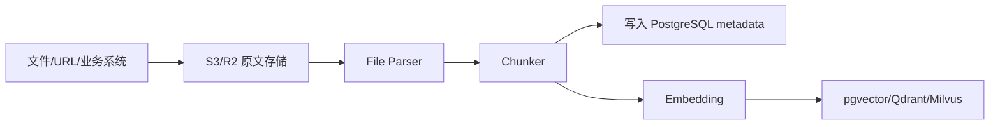

# Enterprise RAG Permissions Implementation Plan

**Goal:** 为 SmartDiagram 增加企业知识库检索能力，并保证 RAG 全链路遵守租户、团队、项目和文档 ACL。

**Architecture:** 文件进入对象存储，解析后生成结构化 chunk。PostgreSQL 保存文档、chunk metadata、ACL 和 ingestion 状态，pgvector/Qdrant/Milvus 保存 embedding。检索时先用权限 metadata filter 缩小范围，再对召回结果做 ACL 二次校验，最后只把有权限的上下文注入 Agent。

---

## Data Model

新增表建议：

| Table | Purpose |
| --- | --- |
| `knowledge_sources` | 知识源，如上传文件、Wiki、URL、业务系统 |
| `knowledge_documents` | 原始文档记录和对象存储 key |
| `knowledge_chunks` | 文档切片、摘要、权限 metadata |
| `knowledge_embeddings` | embedding 关联记录，或由向量库外部维护 |
| `knowledge_acl` | 文档/知识源授权规则 |
| `knowledge_ingestion_jobs` | 解析、切片、embedding 任务状态 |

每个文档和 chunk 必须带：

```text
tenant_id
team_id
project_id
source_id
document_id
classification
acl_json
created_by
```

## Ingestion Pipeline



### Task 1: Add knowledge models

**Files:**

- Create: `backend/app/models/knowledge.py`
- Modify: `backend/app/core/db.py`

**Steps:**

1. Add SQLModel tables for source, document, chunk, ACL, ingestion job.
2. Import `knowledge` in DB init.
3. Verify:

```bash
cd backend && python3 -m py_compile app/models/knowledge.py app/core/db.py
uv run python -c "from sqlmodel import SQLModel; from app.models import knowledge; print(sorted(SQLModel.metadata.tables.keys()))"
```

### Task 2: Add document upload endpoint

**Files:**

- Create: `backend/app/api/routes_knowledge.py`
- Modify: `backend/app/main.py`

**Steps:**

1. Add `POST /api/knowledge/documents` for multipart upload.
2. Require permission context.
3. Store original file in local dev storage first, later S3/R2.
4. Create `knowledge_documents` record.

### Task 3: Add parser service

**Files:**

- Create: `backend/app/services/file_parser_service.py`

**Steps:**

1. Parse PDF with `pypdf`.
2. Parse Word with `python-docx`.
3. Parse Excel with `pandas/openpyxl`.
4. Return normalized text blocks and table blocks.

### Task 4: Add chunking service

**Files:**

- Create: `backend/app/services/knowledge_chunker.py`

**Policy:**

- Prefer semantic headings when available.
- Keep chunks around 500-1000 tokens.
- Store source page/sheet/heading references.
- Store short deterministic summary for each chunk.

### Task 5: Add embedding service

**Files:**

- Create: `backend/app/services/embedding_service.py`
- Create: `backend/app/services/vector_store.py`

**Policy:**

- pgvector for simple single-Postgres deployment.
- Qdrant for dedicated vector workload.
- Milvus only if scale requires it.

### Task 6: Add permission-aware retriever

**Files:**

- Create: `backend/app/services/knowledge_retriever.py`

Retrieval must follow:

```text
1. Build permission context.
2. Apply tenant_id filter.
3. Apply team/project/source/document ACL metadata filter.
4. Vector search top_k.
5. Re-check every returned chunk with permission_service.
6. Return only allowed chunks with citations.
```

### Task 7: Wire Knowledge Agent

**Files:**

- Create: `backend/app/agents/knowledge_agent.py`
- Modify: `backend/app/agents/orchestrator.py`

**MVP behavior:**

- Current graph can keep the existing direct route.
- Enterprise graph should call Knowledge Agent before Chart Agent.
- If no authorized context is found, continue with generic template and mark `knowledge_status=no_authorized_context`.

## Security Rules

- Never trust vector-store-only filtering.
- Never inject unauthorized chunk text into LLM prompt.
- Never return source snippets without checking ACL.
- Always record which chunk ids were used by an Agent run.
- Sensitive business API tools must require explicit scope.

## Acceptance Criteria

- A user can upload a document into a project-scoped knowledge base.
- Chunks include tenant/project/team/source metadata.
- Retrieval returns no chunks outside the user permission context.
- Agent run audit records include used chunk ids.
- Generated diagram can cite the knowledge source ids used.

## Execution Update - 2026-05-26

已完成的 MVP 闭环：

- Added knowledge models for sources, documents, chunks, embeddings, ACL records, and ingestion jobs.
- Added `POST /api/knowledge/documents` for local-dev document upload, parsing, chunking, and deterministic embedding registration.
- Added `POST /api/knowledge/search` with tenant/project/team filters and second-pass role/scope ACL checks.
- Added `Knowledge Agent` into the graph before diagram generation, and sanitized `knowledge_context` SSE events so raw chunk text is not streamed to the browser.
- Added `knowledge:read` and `knowledge:write` scope checks.
- Added project membership checks for project-scoped upload and search requests.
- Added deterministic CJK-aware lexical retrieval for local development.
- Added explicit `KnowledgeACL` policy evaluation with deny precedence and fallback to metadata ACL only when no persisted ACL applies.
- Added deterministic prompt-injection scanning for knowledge chunks. Ingestion persists per-chunk scan metadata, retrieval re-scans candidates, high-risk chunks are blocked from prompt injection, and Knowledge Agent audit metadata includes safe chunk scan summaries.
- Added async ingestion mode for uploaded documents. `ingestion_mode=async` creates a queued `KnowledgeIngestionJob`, runs parsing/chunking/embedding in a background task, and exposes `GET /api/knowledge/ingestion-jobs/{job_id}` for status polling.
- Added DB-backed local vector retrieval. Retrieval now reads `KnowledgeEmbedding` registrations, rebuilds a deterministic local vector candidate set, blends vector similarity with lexical score, and falls back to lexical search when embeddings are unavailable. The same ACL and prompt-injection checks still run after candidate retrieval.
- Added `npm run smoke:knowledge` to verify ingestion and ACL isolation against Docker PostgreSQL.

Verified against Docker PostgreSQL:

```bash
npm run db:up
npm run smoke:knowledge
```

Smoke result:

```text
document_id=<generated>
source_id=<generated>
authorized_chunks=1
OK: enterprise knowledge ingestion/ACL smoke passed
```

The smoke covers:

- upload denied without `knowledge:write`
- authorized project/role search returns chunks and citations
- persisted `KnowledgeACL` rules are created during upload
- explicit `KnowledgeACL` deny overrides document metadata ACL
- prompt-injection text is detected at ingestion, blocked during retrieval, and scan results are persisted on the chunk metadata
- async upload returns an ingestion job, the job reaches `completed`, and the asynchronously indexed document becomes searchable
- search results include hybrid vector retrieval metadata and confirm local vector embedding registration
- project member with wrong document role returns no chunks
- wrong project is denied
- wrong tenant is denied
- search denied without `knowledge:read`

Remaining enterprise hardening:

- Add Milvus adapter only if workload outgrows single-Postgres pgvector and dedicated Qdrant deployments.
- Replace lightweight Redis list worker invocation with Celery/RQ/Arq workers for high-throughput multi-instance deployments and large external enterprise sources.
- Connect the security policy engine to an external ML classifier if enterprise data shows high false-positive or false-negative rates.

## Execution Update - 2026-05-26 DB-Backed Local Vector Index

Implemented:

- Ingestion now persists the deterministic embedding vector in `KnowledgeEmbedding.metadata_json.vector` instead of only registering metadata.
- Retrieval reads persisted vectors from `KnowledgeEmbedding` and builds candidates from stored vectors, avoiding per-query vector rebuilding from chunk text for newly indexed documents.
- Legacy embeddings without stored vectors still use a marked `reconstructed_legacy` fallback.
- Retrieval metadata exposes `vector_source=stored_embedding|reconstructed_legacy` for debugging and smoke assertions.
- `smoke:knowledge` verifies uploaded and async-ingested documents both persist vectors and retrieve from `stored_embedding` vectors.

## Execution Update - 2026-05-26 Queued Ingestion Worker Boundary

Implemented:

- Added `run_pending_knowledge_ingestion_jobs_once` to process queued ingestion jobs from PostgreSQL state.
- `ingestion_mode=queued` now creates a queued job without automatically attaching a FastAPI background task.
- Local/dev deployments can call the worker helper from a scheduler; production can replace the caller with Redis/Celery/RQ/Arq while preserving job state and status polling.
- `smoke:knowledge` verifies a queued upload stays queued, the worker completes it, and the resulting document becomes searchable.

## Execution Update - 2026-05-26 Knowledge Object Storage

Implemented:

- Knowledge uploads now store original files through the shared object storage abstraction instead of directly depending on a local filesystem path.
- Document metadata records `storage_backend` and object checksum for audit/debug visibility.
- Ingestion can materialize the original document from object storage into a local parse cache, so queued jobs remain recoverable after process restarts or cache cleanup.
- `smoke:knowledge` deletes the queued document parse cache before worker execution, then verifies the worker restores the file from object storage and indexes it.

## Execution Update - 2026-05-26 Redis Ingestion Queue

Implemented:

- Added a minimal Redis list queue helper for job id enqueue/dequeue without adding external Python dependencies.
- `ingestion_mode=redis` now commits the PostgreSQL ingestion job and enqueues its id into `KNOWLEDGE_INGESTION_REDIS_QUEUE`.
- Added `run_redis_knowledge_ingestion_jobs_once` to consume queued job ids from Redis and process them through the existing ingestion state machine.
- PostgreSQL remains the authoritative job state; Redis is only the delivery queue.
- `smoke:knowledge` uses a real Redis queue to verify upload enqueue, worker consumption, indexing completion, and searchability.

## Execution Update - 2026-05-26 Optional pgvector Backend

Implemented:

- Added `KNOWLEDGE_VECTOR_BACKEND=local_db|pgvector` with local DB-backed vectors remaining the default.
- Added pgvector schema helpers that create the `vector` extension and a `knowledge_embedding_vectors` nearest-neighbor table when pgvector mode is enabled.
- Ingestion can sync embeddings into pgvector while preserving `KnowledgeEmbedding` as the metadata registry.
- Retrieval now tries pgvector nearest-neighbor search first when enabled, then keeps the existing ACL and prompt-injection second pass.
- `KNOWLEDGE_VECTOR_FALLBACK_TO_LOCAL=true` lets deployments fall back to DB-backed local vectors if pgvector is not available.
- Docker Compose now uses the `pgvector/pgvector:pg16` image for new local database deployments.
- `smoke:knowledge` includes an offline pgvector literal check while the default runtime continues to verify local DB-backed retrieval.

## Execution Update - 2026-05-26 Optional Qdrant Backend

Implemented:

- Added `KNOWLEDGE_VECTOR_BACKEND=qdrant` as an optional dedicated vector-store mode while keeping `local_db` as the default.
- Added a minimal Qdrant HTTP adapter with collection initialization, point upsert, tenant-first metadata filtering, and payload-shaped retrieval results.
- Qdrant stores chunk ids, source/document ids, tenant/team/project metadata, embedding model, and debug metadata in point payloads; PostgreSQL remains the source of truth for ACL and chunk content.
- Retrieval can use Qdrant nearest-neighbor candidates first, then applies the same PostgreSQL ACL and knowledge security policy second pass before injecting context into the Agent.
- Docker Compose exposes an optional `qdrant` profile, so local enterprise testing can start Qdrant only when that backend is explicitly needed.

## Execution Update - 2026-05-26 Knowledge Security Policy Engine

Implemented:

- Added a policy decision layer on top of deterministic prompt-injection scanning.
- Policy decisions include action (`allow|review|block`), severity, confidence, reason, trusted term hits, policy mode, and block threshold.
- `KNOWLEDGE_SECURITY_BLOCK_SEVERITY`, `KNOWLEDGE_SECURITY_POLICY_MODE`, and `KNOWLEDGE_SECURITY_TRUSTED_TERMS` make the policy configurable without code changes.
- Ingestion persists both raw scan findings and compact policy metadata on each chunk.
- Retrieval re-evaluates policy before prompt injection and blocks chunks by policy action, not just raw severity.
- `smoke:knowledge` verifies benign content is allowed and high-risk prompt-injection content is blocked by persisted and retrieval-time policy decisions.
