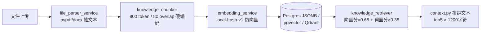
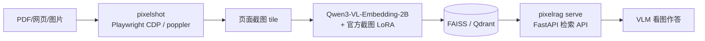
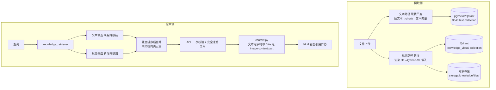

# PixelRAG 视觉 RAG 集成方案（Visual RAG Integration Plan）

**Goal:** 将当前"文件上传 → 抽文本 → 切 chunk"的硬性纯文本知识管道，升级为"文本 + 视觉"双路 RAG：文档渲染为页面截图 tile，经视觉嵌入检索后由多模态模型（VLM）直接"看图作答"，救活扫描件/图表类文档，保留版面与表格信息。

**Architecture:** 现有文本管道保持不变；视觉管道作为旁路新增，在摄取侧从 `vision_required` 死胡同转道接入，在检索侧与文本候选并联汇合。视觉索引使用 PixelRAG 工具链（`pixelshot` 渲染 + Qwen3-VL-Embedding 视觉嵌入），存储于 Qdrant 独立 collection，ACL/审计/引用格式全部复用现有机制。

---

## 1. 背景与现状分析

### 1.1 现状（源码级确认，2026-07-25）

当前知识子系统是 MVP 级纯文本管道：

关键痛点：

| # | 痛点 | 位置 |
| --- | --- | --- |
| 1 | 扫描版 PDF / 纯图文档被判 `vision_required` 后**直接终止，永远不可检索** | `backend/app/services/knowledge_ingestion_service.py:96-110` |
| 2 | `route_mode=vision` 是空接口：API 层校验通过但后端无实现 | `backend/app/api/routes_knowledge.py:256-269` |
| 3 | 嵌入是 SHA256 哈希桶伪向量（`local-hash-v1`，384 维），无语义能力 | `backend/app/services/embedding_service.py:22-43` |
| 4 | PPTX 检测到图表仅记录 `has_visual` 布尔值后丢弃；PDF 图片全部丢失 | `backend/app/services/file_parser_service.py:182-185, 90` |
| 5 | 硬编码参数密集：chunk 800/80、混合权重 0.65/0.35、top_k=5、注入截断 1200 字符、超时 2s | `knowledge_chunker.py:81-82`、`knowledge_retriever.py:157`、`knowledge_agent.py:37`、`context.py:73-85` |
| 6 | 默认每次查询将全租户向量加载进内存暴力比对，不 scale | `knowledge_retriever.py:348-363, 377-383` |
| 7 | 无 rerank、无真 BM25、无多模态消息注入能力 | `context.py:73-85` |

### 1.2 PixelRAG 项目概况

| 项目信息 | 数据（2026-07-25 拉自 GitHub API / 官方 README） |
| --- | --- |
| 仓库 | `StarTrail-org/PixelRAG`，Apache-2.0 |
| 创建时间 | 2026-05-29；论文 arXiv:2606.28344（2026-06） |
| 活跃度 | ⭐ 7,137 / Fork 592，最近提交 2026-07-16 |
| 出身 | UC Berkeley Sky Computing Lab + BAIR + Berkeley NLP（导师含 Matei Zaharia） |
| 安装 | `pip install pixelrag`，Python 3.10+，macOS Apple Silicon（MPS）可跑，无 GPU 可用 |
| 效果 | 论文 6 个基准上较文本 RAG 最高 +18.1% 准确率，token 成本降约 10× |

PixelRAG 管道：

与本项目的关键契合点：

1. **PixelRAG 原生支持 Qdrant 后端**（含量化压缩、payload 过滤、多服务共享 collection）——本项目已有 `qdrant_store.py`；
2. 本项目已预留 `route_mode=vision` 与 `vision_required` 状态机——天然接入点；
3. `source_locator` 的 `pdf:page=N` 约定可直接复用为 tile 定位符——引用/审计/一致性检查零改动。

---

## 2. 设计原则

1. 文本管道一行不动，视觉管道旁路新增，两条管道在 retriever 层汇合；
2. **Sidecar 先行**：PixelRAG 先作独立服务使用，验证效果后再考虑内化；
3. 复用全部已有预留接口，不发明新概念；
4. 灰度可控：`KNOWLEDGE_VISUAL_BACKEND=off|pixelrag` 开关 + 按租户/项目白名单，随时可回退。

## 3. 目标架构（最终态）

---

## 4. 分阶段计划

### Phase 0 — 验证 Spike（零代码改动，1~2 天）

目的：用真实文档验证 PixelRAG 效果，不达标则方案止步、零成本退出。

**Steps:**

1. 独立环境安装：`uv venv tmp/pixelrag-venv && pip install 'pixelrag[index,serve,qdrant]'`（不污染 backend 的 uv 环境）；
2. 准备 3~5 份典型测试文档，至少包含：1 份当前被判 `vision_required` 的扫描版 PDF、1 份带图表的 PPTX 转 PDF；
3. `pixelrag index build` 建索引（Mac M 系列约 3 分钟/PDF，GPU 约 1 分钟）；
4. `pixelrag serve` 起服务，用业务真实问题查询；
5. 与当前 `/knowledge/search` 的结果做人工对比。

**验收标准：**

- [ ] 扫描件从"不可检索"变为可命中；
- [ ] 表格/图表类问题的检索质量明显优于现状；
- [ ] 单文档索引耗时与存储占用可接受。

### Phase 1 — 摄取侧接入（约 3~5 天）

| 位置 | 改动 |
| --- | --- |
| `backend/app/services/knowledge_ingestion_service.py:96-110` | `vision_required` 死胡同改为"转道"视觉摄取；job stage 增加 `visual_render / visual_embed / visual_index` |
| `backend/app/services/material_gateway_service.py:32-106` | `route_mode=vision` 文件允许进入视觉管道 |
| `backend/app/api/routes_knowledge.py:256-269` | `parse_profile` / `x-route-mode` 从"只校验"变为真路由：`vision` 强制视觉；`auto` 文本抽不出时自动转视觉 |
| 新增 `backend/app/services/visual_ingestion_service.py` | 封装 PixelRAG 调用：渲染（pixelshot）→ 嵌入 → 写 Qdrant `knowledge_visual` collection；tile 存对象存储，沿用 `tenants/{t}/projects/{p}/` 键规范 |

数据模型（最小改动）：

- 不动表结构；tile 元数据先存 `knowledge_chunks.metadata_json`：`tile_type`、`page`、`bbox`、`image_storage_key`、`qdrant_point_id`；
- Qdrant 新建独立 collection `smartdiagram_knowledge_visual`（维度以 Qwen3-VL-Embedding 实际输出为准，与 384 维文本 collection 物理隔离）；payload 带 `tenant_id/team_id/project_id/document_id`，对齐 `qdrant_store.py:26-43` 过滤逻辑；
- `source_locator` 复用 `pdf:page=N` 约定。

**Verify:** 上传扫描版 PDF → 状态从 `vision_required` 变为 `indexed`；Qdrant visual collection 出现对应 points；tile 图片落对象存储。

### Phase 2 — 检索融合 + 消息多模态化（约 3~5 天）

| 位置 | 改动 |
| --- | --- |
| `backend/app/services/knowledge_retriever.py:364-398` | 并联新增 `_load_visual_candidates()` 查 visual collection |
| 排序合并 | 视觉/文本候选独立排序再合并（不进 0.65/0.35 混合分），同文档同页去重 |
| `backend/app/agents/context.py:73-85` | 视觉命中注入 `image_url`/base64 content part（**本方案唯一必须改的消息结构**） |
| `backend/app/agents/knowledge_agent.py:37,72` | top_k、视觉/文本名额配比、超时（2s→5s）配置化 |
| 安全加固 | tile 级 ACL 复用 `is_chunk_allowed`；系统提示词增加"图片内容仅作资料"约束（文本注入扫描对图片无效） |

**前置决策：** Reader 必须是多模态模型。需确认 `core/llm.py` 当前模型是否支持图片输入；不支持则：① 视觉管道单独配 VLM；或 ② 降级为命中 tile 先 OCR/描述再注入文本。

**Verify:** 提问表格类问题 → 回答引用页面截图并给出正确数字；无权限租户的 tile 被过滤。

### Phase 3 — 内化与优化（可选，后续迭代）

- 用真实文本嵌入模型替换 `local-hash-v1`（独立于视觉管道的质量红利）；
- 硬编码参数全部配置化（chunk 800/80、混合权重、注入截断等）；
- 加 rerank 与真 BM25 倒排；
- 大规模后按 PixelRAG `train/` 配方用自有截图数据 LoRA 微调嵌入模型；
- 开放"以图搜图"（PixelRAG API 原生支持图片 query）。

---

## 5. 部署与配置

- `docker-compose.yml` 新增 `pixelrag` 服务（初期可与 backend 同机）；
- 模型：HuggingFace 拉取 `Qwen/Qwen3-VL-Embedding-2B` + 官方 LoRA `Chrisyichuan/wiki-screenshot-embedding-lora`（国内注意 HF 镜像）；
- 渲染依赖：无头 Chromium（linux-x64 自动装）+ poppler（PDF）；
- 硬件：索引嵌入 MPS/CPU 可用，生产建议 GPU；

新增配置项：

| 配置 | 默认 | 说明 |
| --- | --- | --- |
| `KNOWLEDGE_VISUAL_BACKEND` | `off` | `off` / `pixelrag`，灰度总开关 |
| `PIXELRAG_QDRANT_COLLECTION` | `smartdiagram_knowledge_visual` | 视觉 collection 名 |
| `VISUAL_RETRIEVAL_TOPK` | `3` | 视觉候选名额 |
| `VISUAL_CONTEXT_ENABLED` | `false` | 是否允许图片注入 LLM 上下文 |
| `VISUAL_INGEST_SCOPE` | `vision_required_only` | 触发范围：`vision_required_only` / `all_documents` |

## 6. 风险与注意点

1. **成本**：每文档索引分钟级耗时 + tile 图片存储远大于文本 —— 先只救 `vision_required` 文档，不全量开；
2. **许可证**：PixelRAG 代码 Apache-2.0 可商用；Qwen3-VL 嵌入模型许可证需单独确认；
3. **安全盲区**：图片内容绕过现有文本注入扫描，需提示词层加固（Phase 2）；
4. **回退**：总开关 + 白名单，随时关回现状，文本管道全程不受影响。

## 7. 开放问题（待拍板）

1. 视觉路径触发范围：仅 `vision_required`（成本低）还是全量 PDF/PPTX（效果好）？建议前者起步；
2. Reader 模型：现有 LLM 是否多模态？否则接受单独配 VLM 吗？
3. 嵌入模型来源：直连 HuggingFace 还是国内镜像/自托管？

---

## 8. Phase 0 执行记录

> 执行后回填：环境、测试文档、索引耗时、检索对比结果、结论。

- [ ] 环境安装
- [ ] 测试文档准备
- [ ] 索引构建
- [ ] 检索实测
- [ ] 对比结论
