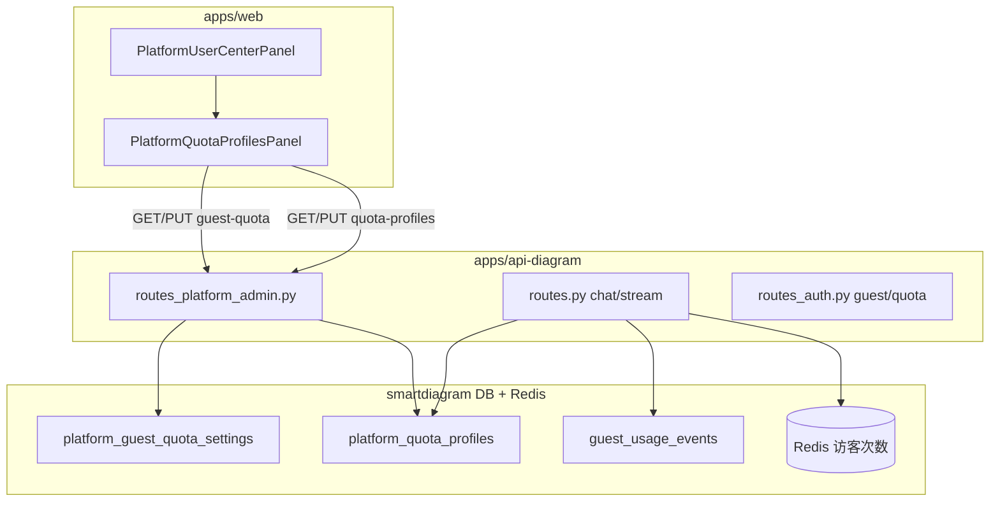

# 执行记录：平台用户中心 — 权限分级与用量配额

> **文档类型**：执行过程 + 经验 + 流程规范  
> **关联功能**：平台用户中心、访客认证、AI 用量 guardrails  
> **最后更新**：2026-07-26

---

## 1. 需求演进（时间线）

| 阶段 | 诉求 | 产出 |
|------|------|------|
| A | 历史数据区分正式/访客；启动自动归类 | `platform_user_classification` + `guest_identity_migration_service` |
| B | `PLATFORM_ADMIN_EMAILS` 无效；权限 DB 化 | `user_platform_roles` + bootstrap |
| C | 账户分级（tier/kind/租户角色） | `account_profile_service` + `scope_catalog` |
| D | 区分「租户管理员」与「平台超管」文案 | `i18n` + 面板分区 |
| E | 禁止用户修改自己的权限 | `cannot_modify_self` 前后端 |
| F | 「有效权限数」易误解 → 改文案 | `功能权限数`（scope 计数，非 Token） |
| G | 按角色批量 Token/金额配额 + 拦截 | `platform_quota_profiles` + `user_quota_service` |
| H | 访客额度统一进面板（非仅 `.env`） | `platform_guest_quota_settings` + 面板「访客用户额度」 |

---

## 2. 方案决策（权重示例）

### 2.1 正式用户配额：逐个改 vs 按角色模板

| 方案 | 说明 | 评分 |
|------|------|------|
| A. 每用户 `preferences_json` 单独限额 | 灵活，N 用户 N 次操作 | 6/10 |
| **B. tier + tenant_role 模板，运行时合并** | 批量生效，改一行影响一类用户 | **9/10** ✓ |

选用 **B**：`platform_quota_profiles(profile_type, profile_key)`，合并规则为 **各维度取更严的非零上限**。

### 2.2 访客配额：继续 `.env` vs DB + 面板

| 方案 | 说明 | 评分 |
|------|------|------|
| A. 仅 `.env` | 改配置要重启/ redeploy | 5/10 |
| **B. DB 单例 + 面板编辑，env 作种子** | 与正式用户同一入口，运维一致 | **9/10** ✓ |

选用 **B**：`platform_guest_quota_settings`（`id=platform-default`）。

### 2.3 概念命名

| 原表述 | 问题 | 现表述 |
|--------|------|--------|
| 有效权限数 | 像调用次数 | **功能权限数**（`resolve_effective_scopes()` 条目数） |
| admin 徽章 | 与平台超管混淆 | **租户管理员** / **平台超管** |

---

## 3. 架构概览



### 身份与配额归属

| 身份 | 功能权限 scopes | 用量配额 | 面板 Tab |
|------|-----------------|----------|----------|
| 正式用户 | tier + kind + 租户 role | tier 模板 ∩ role 模板 | 额度模板 → 等级/角色表 |
| 新访客 `guest_sessions` | 无（访客 Bearer） | 访客用户额度块 | 额度模板 → 访客块 |
| 历史访客 `legacy_guest` | 无 | **未接入拦截**（仅统计） | 访客用户列表只读 |

---

## 4. 超限拦截执行顺序（`/api/chat/stream`）

**正式用户：**

1. `evaluate_runtime_request_async` — 单次请求预估 / 速率
2. `evaluate_tenant_budget` — 租户月 Token/金额（`tenant_usage_budgets`）
3. `evaluate_user_budget` — 用户 tier+role 模板（`platform_quota_profiles`）
4. 通过后进入 LangGraph 流式生成

**访客：**

1. `consume_guest_ai_quota` — Redis 滑动窗口 **次数**（`429 guest_quota_exhausted`）
2. `evaluate_runtime_request_async`
3. `evaluate_guest_budget` — `guest_usage_events` 日/月 Token/金额（`402 guest_*`）
4. `record_guest_ai_usage` — 写入用量事件

**硬限制开关**：`hard_limit_enabled=false` 时只统计、不拒绝。

---

## 5. 关键文件定位

| 用途 | 路径 |
|------|------|
| 平台 API | `apps/api-diagram/app/api/routes_platform_admin.py` |
| 拦截入口 | `apps/api-diagram/app/api/routes.py`（`chat_stream`） |
| 正式用户配额服务 | `apps/api-diagram/app/services/user_quota_service.py` |
| 访客配额 DB 服务 | `apps/api-diagram/app/services/guest_quota_settings_service.py` |
| 访客 Redis 次数 | `apps/api-diagram/app/services/guest_quota_service.py` |
| 模型 | `app/models/platform_quota.py`、`platform_guest_quota.py` |
| 功能权限 scopes | `app/services/scope_catalog.py`、`account_profile_service.py` |
| 前端用户列表 | `apps/web/.../PlatformUserCenterPanel.tsx` |
| 前端额度模板 | `apps/web/.../PlatformQuotaProfilesPanel.tsx` |
| 产品说明（访客） | `docs/GUEST_AUTH.md` |
| 单元测试 | `tests/test_user_quota_service.py`、`test_guest_quota_settings.py`、`test_platform_role_mutations.py` |

---

## 6. API 速查

| 方法 | 路径 | 说明 |
|------|------|------|
| GET | `/api/platform/quota-profiles` | 等级 + 角色模板列表 |
| PUT | `/api/platform/quota-profiles` | 批量保存模板 |
| GET | `/api/platform/guest-quota` | 访客统一策略 |
| PUT | `/api/platform/guest-quota` | 保存访客策略 |
| PATCH | `/api/platform/users/{id}/account` | tier/kind/租户角色（不可改自己） |
| PATCH | `/api/platform/users/{id}/platform-roles` | 平台超管（不可改自己） |
| GET | `/api/auth/guest/quota` | 访客端查剩余次数 |

---

## 7. 实施流程规范（后续同类需求参照）

### 7.1 分析

1. 明确 **身份维度**（正式 / 访客 / 历史）是否共用一套限额。
2. 区分 **功能权限**（scope，能不能做）与 **用量配额**（用多少）。
3. 查是否已有 guard（租户 budget、guest Redis、runtime guard），避免重复或遗漏顺序。

### 7.2 方案

1. 列出 2 个方案并 **权重评分**，选最小可维护方案。
2. 批量配置优先 **模板表 + 运行时 resolve**，避免 per-user 手改。
3. env 仅作 **bootstrap 种子**，运行时以 DB 为准（与 `user_platform_roles` 一致）。

### 7.3 实现

1. **Model** → `db.py` import → `create_all` 可建表  
2. **Service**（纯逻辑 + 错误码 `ValueError` 子类）  
3. **routes_platform_admin**（平台超管 `_ensure_platform_admin`）  
4. **routes 拦截点**（在 LLM 调用前，有 `runtime_guard` 预估后再做 Token/金额校验）  
5. **前端 Tab/分区** + `i18n` 中英文  
6. **禁止自改**敏感权限（`actor_user_id === target_user_id` → 403）  
7. React 改完 **ReadLints**

### 7.4 文档

| 变更类型 | 更新位置 |
|----------|----------|
| 产品结构 / 拦截规则 | `docs/GUEST_AUTH.md` 或本文 |
| 目录 / API 前缀 / 定位 | `smartdiagram_architecture.md` §8 |
| 操作命令 | `README.md` |
| 执行过程与经验 | `docs/plans/YYYY-MM-DD-*.md` + `docs/README.md` 索引 |

### 7.5 验证

```bash
cd apps/api-diagram
python3 -m unittest tests/test_user_quota_service.py tests/test_guest_quota_settings.py tests/test_platform_role_mutations.py tests/test_account_profile_service.py
```

本地需已安装 `apps/api-diagram` 依赖；改 env/DB 策略后 **重启 api-diagram**，平台超管 **重新登录** 刷新 session。

---

## 8. 经验与坑

1. **「有效权限数」≠ Token** — UI 必须区分 scope 计数与用量 `used/limit`，否则运营误解。  
2. **admin 一词多义** — 租户 `users.role=admin` 与 `platform_admin` 必须分译。  
3. **访客两套体系** — `guest_sessions`（新）与 `legacy_guest`（历史 users 行）不要混在 tier 模板里。  
4. **配额合并取更严** — tier 与 role 同时有值时，对 daily/monthly token/cost 取 **min(非零)**。  
5. **次数 vs Token** — 访客次数走 Redis；Token/金额走 DB 事件表；两层都要在文档和面板写清。  
6. **自改权限** — 平台超管也不能给自己升 tier/撤超管，防误操作与越权。  
7. **Shell 勿 `&&` 链** — 本仓库 macOS/Windows 约定，测试命令分步执行。  
8. **PPT 路径** — 当前拦截主要在 Diagram `/chat/stream`；PPT 模型调用若需同等限额需单独接 `evaluate_*`。

---

## 9. 待办（已知缺口）

- [ ] PPT / `ModelUsageEvent` 其它入口统一接入 user/guest budget  
- [ ] `legacy_guest` 若仍走旧 token，需定义是否映射到访客策略  
- [ ] 平台列表用户较多时，`get_user_quota_snapshot` 逐用户查询可改为批量聚合  
- [ ] 可选：per-user 配额 override（覆盖模板特例）

---

## 10. 相关文档

- [GUEST_AUTH.md](../GUEST_AUTH.md) — 访客认证、归类、拦截 HTTP 码  
- [smartdiagram_architecture.md](../../smartdiagram_architecture.md) §8 — 改动定位表  
- [2026-05-26-enterprise-ops-guardrails.md](./2026-05-26-enterprise-ops-guardrails.md) — 租户 budget 早期设计  
