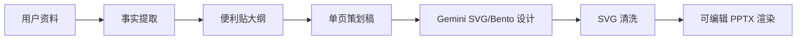

# PPT-agent 维护手册

## 每次继续开发前

```powershell
cd "D:\codex work\PPT-agent\ppt-agent-engine"
git status
corepack pnpm install
corepack pnpm db:generate
corepack pnpm db:migrate
corepack pnpm dev
```

确认服务：

```text
http://127.0.0.1:4000/api/health
http://127.0.0.1:4000/api/ai/status
http://127.0.0.1:5173
```

## Gemini 配置

本地 `.env` 示例：

```env
DATABASE_URL="file:D:/codex work/PPT-agent/ppt-agent-engine/prisma/dev.db"
AI_PROVIDER="gemini"
GEMINI_API_KEY="你的 Gemini API Key"
GEMINI_MODEL="gemini-3.1-flash-lite"
GEMINI_DESIGN_MODEL="gemini-3.5-flash"
```

如果需要代理：

```env
GEMINI_PROXY_URL="http://127.0.0.1:7892"
```

验证 Gemini：

```text
http://127.0.0.1:4000/api/ai/status
```

重点字段：

- `provider` 应为 `gemini`
- `usingMock` 应为 `false`
- `geminiApiKeyConfigured` 应为 `true`
- `designModel` 是页面设计使用的模型

## 导出链路



排查导出质量时优先看：

- `packages/agents/src/prompts.ts`
- `packages/agents/src/realGeminiAdapter.ts`
- `apps/api/src/routes/projects.ts`
- `packages/ppt-renderer/src/index.ts`

## Git 维护

不要提交这些内容：

- `.env`
- `prisma/dev.db`
- `storage/exports/**`
- `node_modules`

常规提交流程：

```powershell
git status
corepack pnpm typecheck
git add README.md .gitignore .env.example docs apps packages prisma package.json pnpm-lock.yaml pnpm-workspace.yaml tsconfig.base.json
git commit -m "chore: update PPT-agent engine"
git push
```

## Render 部署提示

如果部署到 Render，建议拆成两个服务：

- API: Node Web Service，运行 `corepack pnpm --filter @ppt-agent/api start` 或生产脚本
- Web: Static Site，构建 `corepack pnpm --filter @ppt-agent/web build`

生产环境不要继续用本地 SQLite 文件作为长期数据库。后续正式给别人使用时，建议切换到 Postgres，并把 `DATABASE_URL` 设置为云数据库连接串。
