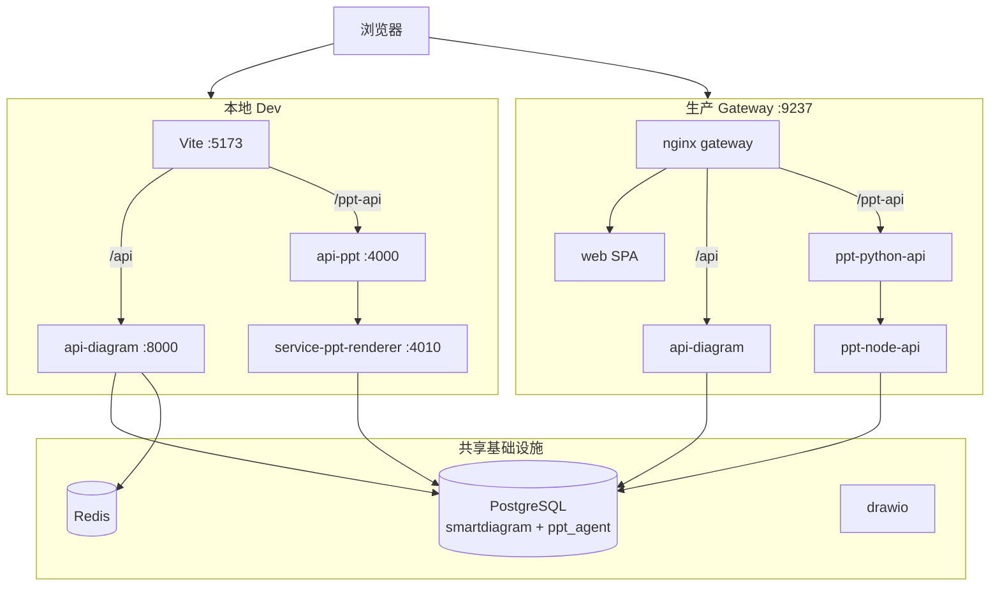

# SmartDiagram 架构 A 文档

> **用途**：架构真相源；AI Agent **先读 [`AGENTS.md`](./AGENTS.md)**，再读本文建立全局地图。  
> **版本**：0.2.0 · **更新**：2026-07-26 · **状态**：与当前 monorepo 对齐

---

## 0. 30 秒速览

| 维度 | 事实 |
|------|------|
| **产品** | 统一桌面式 SPA：`/` 首页 · `/diagram` 智能图表 · `/ppt` AI 演示文稿 |
| **形态** | npm/pnpm monorepo，**一个前端 + 两个后端域 + 网关聚合** |
| **本地** | `npm run dev` → Vite `:5173`，API 由 Vite proxy 分流 |
| **生产** | `gateway :9237` 唯一入口，nginx 分流 SPA / 图表 API / PPT API / draw.io |
| **数据库** | **双库**：`smartdiagram`（图表）+ `ppt_agent`（PPT，Prisma） |
| **配置** | **唯一主配置** 根目录 `.env`（Platform / Diagram / PPT 三分区） |

---

## 1. 设计原则（改代码前先理解）

1. **平台 + 业务模块**：`apps/web` 是统一壳；`/diagram` 与 `/ppt` 是平级业务模块，通过 `modules/registry.tsx` 注册，新增模块只加注册 + 路由。
2. **API 前缀隔离**：图表走 `/api/*` → `api-diagram`；PPT 走 `/ppt-api/*` → `api-ppt`（Python 编排）→ `service-ppt-renderer`（Node 渲染侧车）。
3. **环境变量单源**：根 `.env` 为唯一真相；`apps/*/.env` 仅本机临时覆盖。部署脚本会合并旧 env、校验、自动生成密钥。
4. **LangGraph 编排**：图表与 PPT 均用 Agent 图；路由按 task/engine 分发，SSE 流式输出 `<design_concept>` + `<code>`。
5. **企业能力可选**：知识库、异步导出、worker 队列依赖 PostgreSQL + Redis；`--with-worker` 才启 worker 容器。

---

## 2. 目录地图（改哪里一目了然）

```
SmartDiagram/
├── apps/
│   ├── web/                      # 统一 SPA（React 18 + Vite + Tailwind v4）
│   │   └── src/
│   │       ├── app/main.tsx      # 路由入口：/ · /diagram/* · /ppt/*
│   │       ├── modules/registry.tsx   # 模块注册表（导航 + 首页卡片）
│   │       ├── pages/            # 平台页（home、diagram workspace）
│   │       ├── features/
│   │       │   ├── diagram/      # 图表：chatStore、Canvas、ChatPanel
│   │       │   └── ppt/          # PPT：五步工作流、workbenchStore、api.ts
│   │       └── shared/           # AppShell、auth、settings、macOS 桌面 UI
│   │
│   ├── api-diagram/              # 图表 FastAPI + LangGraph（:8000）
│   │   └── app/
│   │       ├── main.py           # 路由挂载（chat/auth/knowledge/exports/…）
│   │       ├── api/routes.py     # SSE /api/chat/stream 主入口
│   │       ├── agents/           # orchestrator、router、各 engine agent
│   │       ├── services/         # 持久化、知识库、导出、队列、计费…
│   │       └── models/           # SQLAlchemy 模型（smartdiagram 库）
│   │
│   ├── api-ppt/                  # PPT Python 编排 FastAPI（:4000）
│   │   └── src/ppt_agent_api/    # LangGraph 工作流、对 Node 侧车 HTTP 调用
│   │
│   └── service-ppt-renderer/     # PPT Node 侧车（:4010）
│       └── Prisma + PPTX 渲染 + 资料存储
│
├── packages/
│   ├── shared/                   # PPT 共享类型（goalSpec 等）
│   ├── agents/                   # PPT Agent 逻辑（TS）
│   └── ppt-renderer/             # PPTX 渲染核心
│
├── prisma/                       # ppt_agent 库迁移（DATABASE_URL）
├── gateway/
│   ├── nginx.conf                # 生产分流规则
│   └── dev-gateway.mjs           # 本地 gateway 模式（start-all.sh）
│
├── scripts/                      # dev-common、env 校验、bootstrap 密钥、db-wait
├── dev.sh                        # npm run dev 入口
├── deploy.sh                     # 生产部署 / 更新
├── docker-compose.yml            # 全栈容器定义
├── .env / .env.example           # 唯一主配置（三分区）
└── README.md                     # 人类操作手册
```

---

## 3. 运行时拓扑

### 3.1 本地开发（`npm run dev` → `dev.sh`）

```
浏览器 :5173 (apps/web, Vite HMR)
  ├─ /api/*      ──proxy──► api-diagram      :8000
  └─ /ppt-api/*  ──proxy──► api-ppt          :4000
                                    │
                                    └──HTTP──► service-ppt-renderer :4010

Docker（基础设施）:
  db:5432 (smartdiagram + ppt_agent)
  redis:6379
  drawio:9022 → iframe 嵌入 Draw.io 画布
```

### 3.2 生产（`./deploy.sh --with-worker`）

```
gateway :9237 (nginx)
  ├─ /              → web（静态 SPA）
  ├─ /api/          → api-diagram:8000
  ├─ /ppt-api/      → ppt-python-api:4000 → ppt-node-api:4010
  ├─ /drawio/       → drawio
  └─ worker profile → smartdiagram-worker（企业异步任务）

外部只暴露 GATEWAY_PORT（默认 9237）；web/api 走 Docker 内网。
```



---

## 4. 前端架构

### 4.1 路由（`apps/web/src/app/main.tsx`）

| 路径 | 组件 | 说明 |
|------|------|------|
| `/` | `HomePage` | 模块入口卡片 |
| `/diagram/*` | `DiagramWorkspace` | 图表工作台（画布 + 聊天） |
| `/ppt/*` | `PptModule` | PPT 五步工作流 |

所有路由包在 `AppShell` 内（macOS 风格菜单栏、Spotlight、设置）。

### 4.2 模块注册（`modules/registry.tsx`）

新增业务模块：**只改两处** — `moduleRegistry` 加一条 + `main.tsx` 挂 Route。导航栏与首页自动读取注册表。

### 4.3 图表前端（`features/diagram/`）

| 关注点 | 文件 |
|--------|------|
| 状态 | `model/chatStore.ts`（Zustand：messages、canvasAgent、SSE 流） |
| 聊天 | `ui/chat/ChatPanel.tsx` |
| 画布路由 | `ui/layout/CanvasPanel.tsx` → 各 `*Canvas.tsx` |
| Agent 元数据 | `shared/lib/config/diagramAgents.ts` |
| 历史/导出 | `model/diagramHistory.ts`、`ui/ExportButton.tsx` |

**Canvas 与 Engine 对应**（须与后端 `agents/catalog.py` 一致）：

| Engine | Canvas 组件 | 输出形态 |
|--------|-------------|----------|
| excalidraw | ExcalidrawCanvas | Excalidraw JSON |
| mermaid | MermaidCanvas | Mermaid DSL |
| flow | FlowCanvas | React Flow JSON |
| mindmap | MindmapCanvas | Markdown 层级 |
| charts | ChartsCanvas | ECharts option |
| drawio | DrawioCanvas | draw.io XML（iframe） |
| infographic | InfographicCanvas | AntV Infographic |
| html_email / web_report_html | ArtifactCanvas | HTML artifact |

### 4.4 PPT 前端（`features/ppt/`）

| 空间 | 页面 | 职责 |
|------|------|------|
| Intent | `IntentSpace` | 资料上传、Brief、视觉意图 |
| Structure | `StructureSpace` | 大纲便利贴 |
| Studio | `StudioSpace` | 单页 AI 设计与预览 |
| Exports | `ExportsSpace` | PPTX / 视频导出 |

API 封装：`lib/api.ts`（base = `/ppt-api`）。状态：`store/workbenchStore.ts`。
Studio 设计稿按页懒加载最近 5 个 `SlideDesignVersion`；版本导航切换会同步
`activeDesignVersionId` 与 `svgPreview`，因此预览、代码编辑器和导出始终读取同一当前版本。

---

## 5. 图表后端（`apps/api-diagram`）

### 5.1 入口与路由前缀

- 应用：`app/main.py`，前缀由 `settings.API_PREFIX`（通常 `/api`）
- **核心 SSE**：`app/api/routes.py` → `POST /api/chat/stream`
- 其他域：auth、conversations、diagrams、knowledge、exports、admin、billing、pricing…

### 5.2 Agent 编排

```
用户消息 → routes.py (SSE)
         → orchestrator.py (LangGraph)
         → router.py（@tag / 历史上下文 / LLM 分类）
         → 条件边 → 具体 agent
         → StreamingTagParser → SSE 事件
              type: agent | design | code | code_end | error
```

**Task ↔ Engine 映射**（`agents/catalog.py`）：

| Task | Engine |
|------|--------|
| sketch | excalidraw |
| document | mermaid |
| flow | flow |
| mindmap | mindmap |
| data_chart | charts |
| architecture | drawio |
| infographic | infographic |
| html_email | html_email |
| web_report_html | web_report_html |
| general | general |

Agent 文件目录：`app/agents/*_agent.py`；企业向服务在 `app/services/`。

### 5.3 企业/worker 相关

| 能力 | 关键路径 |
|------|----------|
| 异步导出 | `services/export_job_service.py`、`routes_exports.py`（`mode=redis` / `queued`） |
| 知识库 | `services/knowledge_*`、`routes_knowledge.py` |
| 队列 / 锁 | `services/redis_queue_service.py`（List 队列 + worker 分布式锁） |
| Worker 进程 | `scripts/run_enterprise_workers.py`（`npm run worker`） |

---

## 6. PPT 后端（双服务）

```
浏览器 /ppt-api/*
    → api-ppt (Python FastAPI, :4000)
         LangGraph 编排：意图 → 结构 → Studio → 导出任务
    → service-ppt-renderer (Node, :4010)
         Prisma (ppt_agent) · 文件存储 · PPTX 渲染 · TTS/视频
    → api-diagram (内部)
         认证 MATERIAL_GATEWAY · AUTH_SERVICE · PPT_INTERNAL_API_SECRET
```

| 服务 | 数据库 env | ORM |
|------|------------|-----|
| api-diagram | `DIAGRAM_DATABASE_URL` | SQLAlchemy async |
| service-ppt-renderer | `DATABASE_URL` → `ppt_agent` | Prisma |
| api-ppt | 主要调 Node + 文件卷 | — |

共享包：`packages/shared`、`packages/agents`、`packages/ppt-renderer`。其中
`packages/agents/src/designKnowledge/` 统一维护 PPT 的视觉配方、Apple 编辑式 SVG
提示契约，以及生成后的空间碰撞、DOM 层级和视觉反模式质量门禁。

PPT 设计历史由 Prisma `SlideDesignVersion` 按页持久化，AI 生成与手动 SVG 保存都通过
`apps/service-ppt-renderer/src/lib/slideDesignVersions.ts` 的事务入口写入并裁剪至最近 5 条。
`Slide.activeDesignVersionId` 标识活跃版本，`Slide.svgPreview` 保留为活跃 SVG 的物化副本，
使现有 PPTX、PNG、视频和媒体渲染链路无需感知版本表。

---

## 7. 环境变量（根 `.env` 三分区）

| 分区 | 服务 | 关键变量 |
|------|------|----------|
| **Platform** | deploy / docker | `DB_PASSWORD`、`GATEWAY_PORT`、`PPT_INTERNAL_API_SECRET` |
| **Diagram** | api-diagram | `DIAGRAM_DATABASE_URL`、`REDIS_URL`、`OPENAI_*`、`AUTH_*` |
| **PPT** | api-ppt + renderer | `DATABASE_URL`（ppt_agent）、`AI_*`、`STORAGE_DIR` |

**切勿混库**：`DIAGRAM_DATABASE_URL` → `smartdiagram`；`DATABASE_URL` → `ppt_agent`。

校验：`npm run env:validate` · 部署前：`deploy.sh` 自动调用 `scripts/validate-deploy-env.sh`。

---

## 8. 常见改动定位表（给 AI 用）

| 我要… | 先看 |
|--------|------|
| 改图表聊天/SSE 行为 | `api-diagram/app/api/routes.py` + `agents/orchestrator.py` |
| 新增/改绘图引擎 | `agents/catalog.py` + `*_agent.py` + `web/.../CanvasPanel.tsx` + 新 Canvas |
| 改图表 UI/布局 | `features/diagram/ui/` |
| 改登录/权限 | `api-diagram/app/api/routes_auth.py` + `guest_session_service.py` + `identity_service.py` + `web/shared/lib/config/guestSession.ts` |
| 租户用户管理（本租户） | `routes_admin.py` + `UserManagementPanel.tsx`（admin/owner） |
| **平台用户中心（跨租户）** | `routes_platform_admin.py` + `PlatformUserCenterWindow.tsx` / `PlatformUserCenterPanel.tsx` / `PlatformQuotaProfilesPanel.tsx`（桌面入口；`PLATFORM_ADMIN_EMAILS`） |
| **平台用量配额 / 超限拦截** | `user_quota_service.py` + `guest_quota_settings_service.py` + `routes.py` chat/stream；文档 [`docs/plans/2026-07-26-platform-quota-management-execution.md`](docs/plans/2026-07-26-platform-quota-management-execution.md) |
| 改 PPT 工作流 | `api-ppt/src/` + `features/ppt/pages/` |
| 改 PPT 单页设计版本历史 | `prisma/schema.prisma` + `service-ppt-renderer/src/lib/slideDesignVersions.ts` + `routes/slideDesignVersions.ts` + `features/ppt/components/studio/DesignVersionNavigator.tsx` |
| 改 PPTX 渲染 | `packages/ppt-renderer/` + `service-ppt-renderer/` |
| 改生产路由 | `gateway/nginx.conf` |
| 改本地 proxy | `apps/web/vite.config.ts` |
| 改启动/端口 | `dev.sh`、`scripts/dev-common.sh`、`docker-compose.yml` |
| 改部署流程 | `deploy.sh`、`docs/DEPLOYMENT.md` |
| 加 npm 脚本 | 根 `package.json` |

---

## 9. 启动与部署命令

| 场景 | 命令 |
|------|------|
| 本地全栈 | `cp .env.example .env` → 填 LLM 密钥 → `npm run dev` |
| 本地 gateway 模式 | `npm run dev:gateway`（`start-all.sh`） |
| 仅图表 API | `npm run dev:backend` |
| DB 迁移 | `npm run db:prepare` |
| 生产首次/更新 | `./deploy.sh --with-worker` / `./deploy.sh --update --with-worker` |
| env 检查 | `npm run env:validate` |

人类向细节见 [README.md](./README.md)、[docs/DEPLOYMENT.md](./docs/DEPLOYMENT.md)。

---

## 10. 技术栈摘要

| 层 | 选型 |
|----|------|
| 前端 | React 18、TypeScript、Vite、Tailwind v4、Zustand、react-router |
| 图表后端 | FastAPI、LangChain/LangGraph、SQLAlchemy async、PostgreSQL+pgvector、Redis |
| PPT | Python FastAPI + LangGraph；Node 22 + Prisma；共享 TS packages |
| infra | Docker Compose、nginx gateway、draw.io sidecar、可选 Qdrant profile |

---

## 11. 文档维护约定

- **[`AGENTS.md`](./AGENTS.md)**：AI 稳定入口（阅读顺序、CodeGraph 流程、工具选择）；**尽量不随架构变更而改**。
- **本文（A 文档）**：架构真相源；结构/边界/路径/定位表变更时**只更新本文**。
- **README**：操作手册（怎么跑、怎么部署），不写深层实现细节。
- **docs/**：部署、迁移、专项计划等执行记录；入口 [`docs/README.md`](docs/README.md)（文档中心索引）。

CodeGraph 已索引时：先 `AGENTS.md` → 本文建立地图 → `codegraph_explore` 查实现细节。
