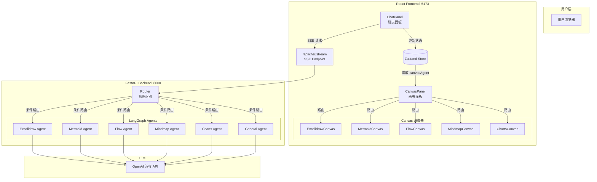

# SmartDiagram 架构文档

> **版本**: 0.1.0 · **日期**: 2026-03-13 · **状态**: MVP 可运行

---

## 一、项目定位

SmartDiagram 是一个 **AI 驱动的智能绘图平台**，用户通过自然语言描述即可生成多种类型的专业图表。核心理念是「对话即绘图」——在一个界面中完成需求描述、AI 理解、图表生成和实时编辑的完整闭环。

### 核心特性

| 特性 | 说明 |
|------|------|
| 多引擎渲染 | 一个平台集成 Excalidraw、Mermaid、React Flow、ECharts、mind-elixir 五种绘图引擎 |
| 智能路由 | LangGraph 驱动的 Agent 编排，自动识别用户意图并分发到对应 Agent |
| 流式响应 | SSE 流式传输，设计思路和代码分离输出，实时渲染 |
| 支持 @tag 语法 | 用户可通过 `@excalidraw`、`@mermaid` 等标签显式选择绘图引擎 |

---

## 二、技术栈

```
┌──────────────────────────────────┐
│          前端 (Frontend)          │
│  React 18 + TypeScript + Vite   │
│  TailwindCSS v4 · Zustand       │
│  react-markdown · lucide-react  │
├──────────────────────────────────┤
│          后端 (Backend)           │
│  FastAPI + LangChain + LangGraph│
│  Python 3.11 · uvicorn          │
├──────────────────────────────────┤
│        基础设施 (Infra)           │
│  Docker Compose · Nginx         │
│  PostgreSQL (可选)               │
└──────────────────────────────────┘
```

### 依赖清单

**前端**:
- `@excalidraw/excalidraw` — 手绘白板
- `reactflow` — 流程图
- `mermaid` — 标准图表（时序图/类图/ER图等）
- `echarts` — 数据可视化图表
- `mind-elixir` — 思维导图
- `react-markdown` + `remark-gfm` — Markdown 渲染
- `zustand` — 状态管理
- `lucide-react` — 图标库

**后端**:
- `fastapi` + `uvicorn` — HTTP 服务
- `langchain` + `langchain-openai` — LLM 集成
- `langgraph` — Agent 编排框架
- `python-dotenv` — 环境变量

---

## 三、系统架构



---

## 四、模块详解

### 4.1 后端模块

```
backend/app/
├── main.py                 # FastAPI 入口 + CORS + 启动钩子
├── api/
│   └── routes.py           # SSE 流式端点 + StreamingTagParser
├── agents/
│   ├── orchestrator.py     # LangGraph 状态图定义
│   ├── router.py           # 意图识别（@tag / LLM 分类）
│   ├── excalidraw_agent.py # → ExcalidrawElement JSON
│   ├── mermaid_agent.py    # → Mermaid 语法
│   ├── other_agents.py     # → Flow JSON / Markmap MD / ECharts JSON
│   └── general_agent.py    # → 自然语言对话
├── core/
│   ├── config.py           # Settings（env 配置）
│   ├── llm.py              # ChatOpenAI 工厂函数
│   ├── db.py               # 数据库连接（可选）
│   └── logger.py           # 日志
├── state/
│   └── state.py            # AgentState TypedDict
├── models/                 # 数据模型（预留）
└── services/               # 业务逻辑（预留）
```

#### 核心数据流

```
用户消息
  ↓
routes.py: /api/chat/stream
  ↓
orchestrator.py: graph.astream_events()
  ↓
router.py: router_node()
  ├─ 检查 @tag 显式指定
  ├─ 检查历史 Agent 上下文
  └─ LLM 意图分类 → intent
  ↓
条件路由 → 对应 Agent
  ↓
Agent 调用 LLM → 输出 <design_concept> + <code>
  ↓
StreamingTagParser 解析标签 → SSE 事件
  ↓
前端接收: { type: 'agent' | 'design' | 'code' | 'code_end' | 'error' }
```

#### Agent 输出格式

每个绘图 Agent 的 System Prompt 要求 LLM 输出固定结构：

```xml
<design_concept>
设计思路描述...
</design_concept>

<code>
具体的图表代码（JSON / Mermaid / Markdown）
</code>
```

| Agent | 输出格式 | 示例 |
|-------|---------|------|
| Excalidraw | `ExcalidrawElement[]` JSON | `[{type:"rectangle",...}]` |
| Mermaid | Mermaid DSL 语法 | `sequenceDiagram\n A->>B: msg` |
| Flow | React Flow `{nodes, edges}` JSON | `{nodes:[...],edges:[...]}` |
| Mindmap | Markdown 标题层级 | `# Root\n## Branch` |
| Charts | ECharts option JSON | `{xAxis:{...},series:[...]}` |
| General | 自然语言 Markdown | 纯对话回复 |

---

### 4.2 前端模块

```
frontend/src/
├── main.tsx                 # React 入口
├── App.tsx                  # 根布局（Canvas 左 65% + Chat 右 35%）
├── index.css                # TailwindCSS v4 @theme + Excalidraw 修复 + 动画
├── store/
│   └── chatStore.ts         # Zustand 状态管理
├── components/
│   ├── layout/
│   │   ├── CanvasPanel.tsx  # 画布容器（5 种 Agent 路由）
│   │   └── ChatPanel.tsx    # 聊天面板（Markdown + Agent 工具栏 + SSE）
│   ├── canvas/
│   │   ├── ExcalidrawCanvas.tsx   # Excalidraw 渲染器
│   │   ├── MermaidCanvas.tsx      # Mermaid 渲染器
│   │   ├── FlowCanvas.tsx         # React Flow 渲染器
│   │   ├── MindmapCanvas.tsx      # mind-elixir 渲染器
│   │   └── ChartsCanvas.tsx       # ECharts 渲染器
│   └── settings/
│       └── SettingsModal.tsx      # 模型配置弹窗
├── hooks/                   # 自定义 hooks（预留）
├── lib/                     # 工具函数（预留）
└── types/                   # TypeScript 类型（预留）
```

#### Zustand Store 状态

```typescript
interface ChatStore {
  messages: Message[]       // 聊天消息列表
  isStreaming: boolean      // 流式传输中
  currentAgent: AgentType   // 当前活跃 Agent
  canvasCode: string        // 画布渲染代码
  canvasAgent: AgentType    // 画布 Agent 类型（决定路由）
  designConcept: string     // AI 设计思路
  modelConfig: ModelConfig  // 模型配置（API Key / Base URL / Model ID）
}
```

#### 布局结构

```
┌─────────────────────────────────────────┬──────────────┐
│                                         │  SmartDiagram │
│            Canvas Panel                 │  Agent 工具栏  │
│           (flex: 1, 65%)                │              │
│                                         │  消息列表      │
│   ┌──────────────────────────────┐      │  · 用户消息    │
│   │ Excalidraw / Mermaid / Flow  │      │  · AI 消息     │
│   │    / MindMap / Charts        │      │  · 设计概念    │
│   └──────────────────────────────┘      │              │
│                                         │  输入框        │
│                                         │ (Enter 发送)  │
├─ 拖拽分隔线 ────────────────────────────┤──────────────┤
│                                         │  width: 380px│
└─────────────────────────────────────────┴──────────────┘
```

---

## 五、已完成功能

### ✅ 后端
- [x] LangGraph 状态图 + 6 个 Agent 节点编排
- [x] 意图路由（@tag 显式 + LLM 分类 + 上下文继承）
- [x] SSE 流式传输 + `<design_concept>` / `<code>` 标签解析
- [x] OpenAI 兼容 API 接入（支持自定义 Base URL）
- [x] 可选数据库连接（无数据库时 stateless 运行）

### ✅ 前端
- [x] 双面板布局（画布左 + 聊天右 + 可拖拽分隔线）
- [x] 5 种 Canvas 渲染器（Excalidraw、Mermaid、Flow、MindMap、Charts）
- [x] ChatPanel Markdown 渲染 + 消息复制 + Agent 工具栏
- [x] SettingsModal 模型配置弹窗（含 API 连接测试）
- [x] Zustand 状态管理
- [x] Excalidraw + TailwindCSS v4 样式隔离
- [x] 空状态引导页 + 交互动画

---

## 六、待完善功能

### 🔴 高优先级

| 功能 | 说明 | 复杂度 |
|------|------|--------|
| 对话历史持久化 | 当前消息仅存在内存中，刷新即丢失。需要后端存储或 localStorage | 中 |
| 图表导出 | 所有 Canvas 统一支持 PNG/SVG/JSON 导出 | 中 |
| 错误重试 | LLM 生成失败后的重试机制和错误提示优化 | 低 |
| 流式渲染最终确认 | code_end 后做一次完整的 JSON 校验再渲染 | 低 |

### 🟡 中优先级

| 功能 | 说明 | 复杂度 |
|------|------|--------|
| 多轮编辑 | 在已有图表上追加修改（"把颜色改成蓝色"） | 高 |
| 模板库 | 预设常用图表模板，一键生成 | 中 |
| 图表代码查看 | 右侧显示生成的代码，支持手动编辑并同步到画布 | 中 |
| 移动端适配 | 响应式布局，小屏切换为上下结构 | 中 |
| 暗色/亮色主题切换 | 画布和聊天面板的主题统一控制 | 低 |

### 🟢 长期目标

| 功能 | 说明 | 复杂度 |
|------|------|--------|
| 用户系统 | 注册/登录 + 项目管理 + 历史图表列表 | 高 |
| 协作编辑 | WebSocket 实时同步多人编辑 | 很高 |
| 自定义 Agent | 用户可创建自定义 prompt 的 Agent | 中 |
| 插件市场 | 社区贡献的绘图模板和 Agent | 高 |
| 自部署 | Docker 一键部署，支持私有 LLM | 中 |

---

## 七、参考项目

| 项目 | 特点 | 可借鉴 |
|------|------|--------|
| [DeepDiagram-Pro](https://github.com/DerekLiii/DeepDiagram-Pro) | LLM 驱动的 Mermaid 绘图 | 原始灵感来源，SSE 流式架构 |
| [Excalidraw](https://excalidraw.com/) | 最流行的手绘白板工具 | 已集成，可参考其协作编辑实现 |
| [tldraw](https://www.tldraw.com/) | 无限白板 + AI 生成 | AI 理解绘图意图的方式 |
| [Eraser.io](https://eraser.io/) | AI 文档 + 图表 | 多图表类型切换的交互设计 |
| [Mermaid Chart](https://www.mermaidchart.com/) | Mermaid 官方编辑器 | 代码高亮 + 实时预览的双面板 |
| [Diagrams (mingrammer)](https://diagrams.mingrammer.com/) | Python 代码 → 架构图 | 代码即图表的理念 |
| [ChatGPT Canvas](https://openai.com/canvas) | OpenAI 的 Canvas 交互 | 对话 + 画布的交互模式 |

---

## 八、启动方式

### 开发环境

```bash
# 1. 后端
cd SmartDiagram/backend
cp .env.example .env  # 填写 OPENAI_API_KEY、OPENAI_BASE_URL、MODEL_ID
uv run uvicorn app.main:app --reload --host 0.0.0.0 --port 8000

# 2. 前端
cd SmartDiagram/frontend
npm install
npm run dev  # → http://localhost:5173
```

### Docker 部署

```bash
cd SmartDiagram
docker-compose up --build
# → Nginx 反向代理 → 前端 :80 / 后端 /api
```

### 环境变量

| 变量 | 必填 | 说明 |
|------|------|------|
| `OPENAI_API_KEY` | ✅ | LLM API 密钥 |
| `OPENAI_BASE_URL` | ✅ | API 基地址（默认 `https://api.openai.com/v1`） |
| `MODEL_ID` | ❌ | 模型名（默认 `gpt-4o`） |
| `TEMPERATURE` | ❌ | 温度（默认 `0.3`） |
| `MAX_TOKENS` | ❌ | 最大 token（默认 `16384`） |
| `DATABASE_URL` | ❌ | PostgreSQL 连接（不配置则 stateless 运行） |
